# Let's start with a quick icebreaker

--

- Your name (and your preferred name):

- Where you come from:

- Your academic background:

- Which program and which year you are:

- A fun fact about yourself:

- Your (research) interests:

- What you hope to do/learn in this course:

---

# About me

- Your name (and your preferred name): Trinh Pham (please call me Trinh)

- Where you come from: Lam Dong, Vietnam

- Your academic background: B.Econ. (VNU-HCM), MPP (KDIS), PhD Applied Econ. (Cornell Univ.)

- Which program and which year you are: 2nd-year Assistant Professor

- A fun fact about yourself: I like jigsaw puzzles, cycling and hiking

- Your (research) interests: development, labor/education, the environment

- What you hope to do/learn in this course: create a supportive learning environment where everyone can share and learn from each other

---

# Plan for this week

We begin by discussing what development means and how it is measured.

--

Next, we explore major global development challenges and the different approaches to address them.

--

Finally, we outline what this course covers and set expectations for your learning journey.

---

class: inverse, middle, center

# 

  What is development?

 

---

# Development is a multidimensional concept

What does it mean by development?

--
*Rapid economic growth*? 

--
*Low inequality*? 

--
*Securing access to basic needs for all*?

--

In most cases, there are **trade-offs**, implying the need to establish social priorities.

--

It is important to be clear about what we mean, when making judgement about development.

--

A good starting point is the Millennium Development Goals.

---

# Millenium Development Goals (MDG) 

The 8 goals were set in 2000, to be achieved in 2015.

  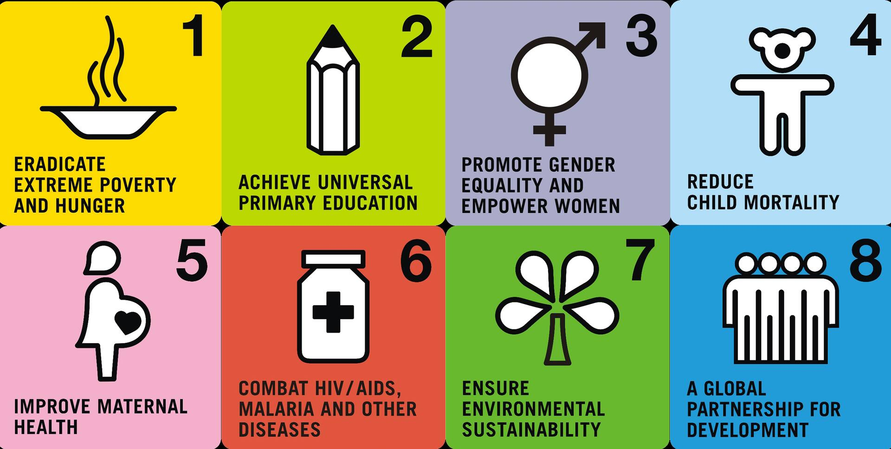 

---

# Sustainable Development Goals (SDG)

SDGs build on MDGs that ended in 2015 with 17 goals and 169 targets.

   

--

Based on MDGs, we can agree on seven dimensions of development, i.e., seven horsemen of underdevelopment.

---

# Seven horsemen of underdevelopment
  
First, low levels of income and insufficient income growth to allow income convergence.

  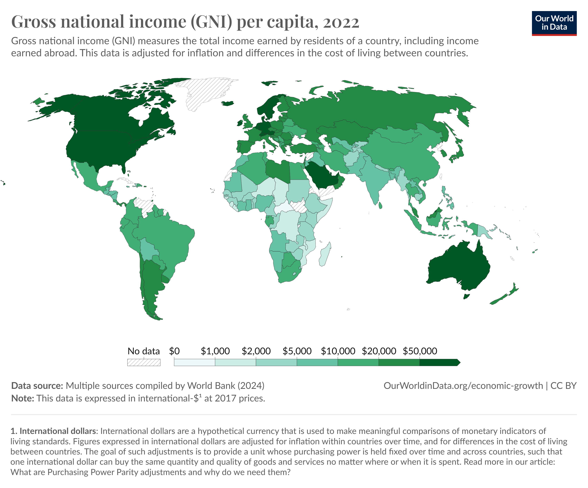 

---

# Seven horsemen of underdevelopment
  
Second, extensive material poverty accompanied by food insecurity and hunger.

  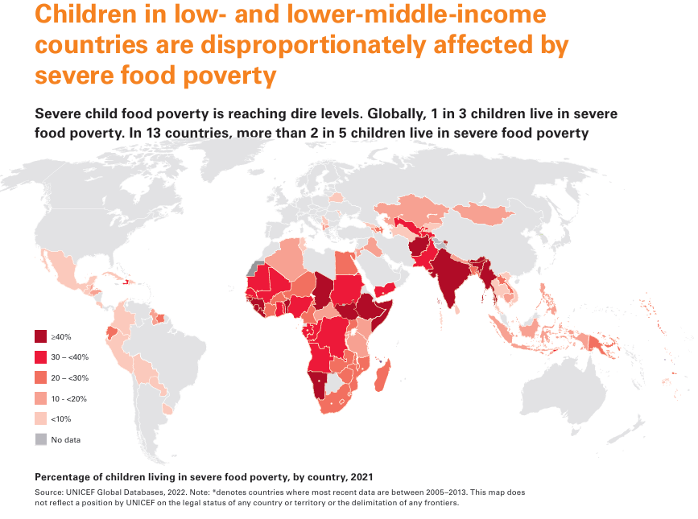 

---

# Seven horsemen of underdevelopment

Third, inequality in the distribution of income and inequity in chances to succeed.

  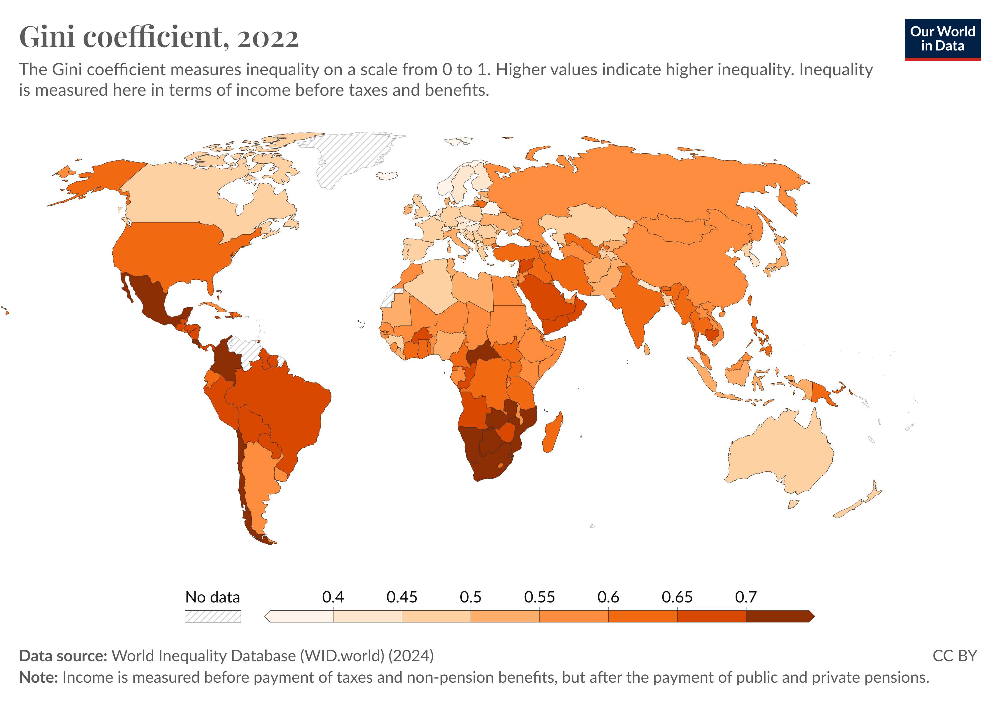 

---

# Seven horsemen of underdevelopment

Fourth, vulnerability to shocks and risk of falling into poverty and poverty traps.

  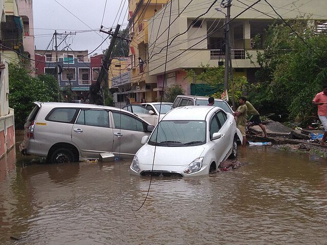 
  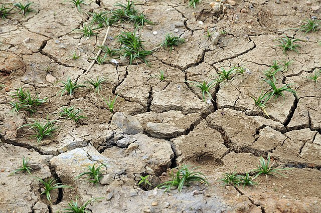 

---

# Seven horsemen of underdevelopment

Fifth, lack of satisfaction of basic needs in human development, e.g., health and education.

  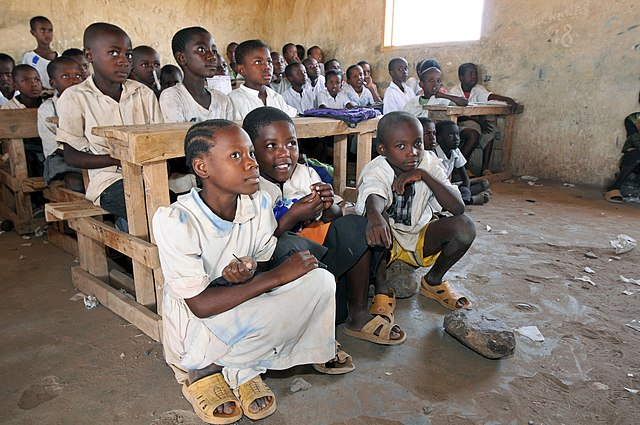 
  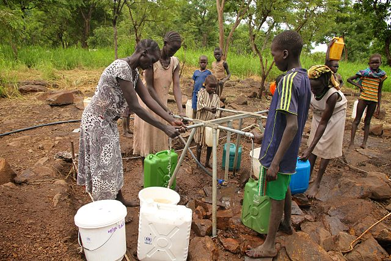 

---

# Seven horsemen of underdevelopment 

Sixth, lack of intergenerational sustainability.

   
  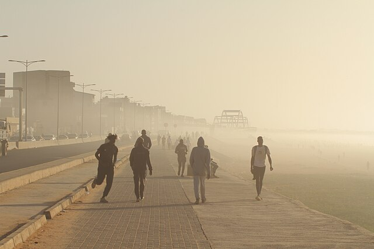 
  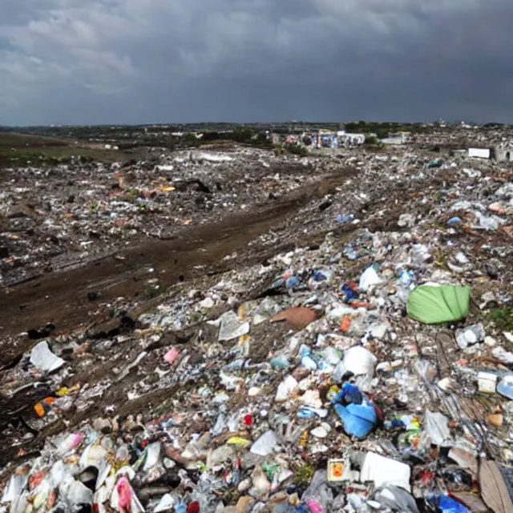 

---

# Seven horsemen of underdevelopment 

Seventh, unsatisfactory "quality of life": e.g., individual freedoms, human rights.

  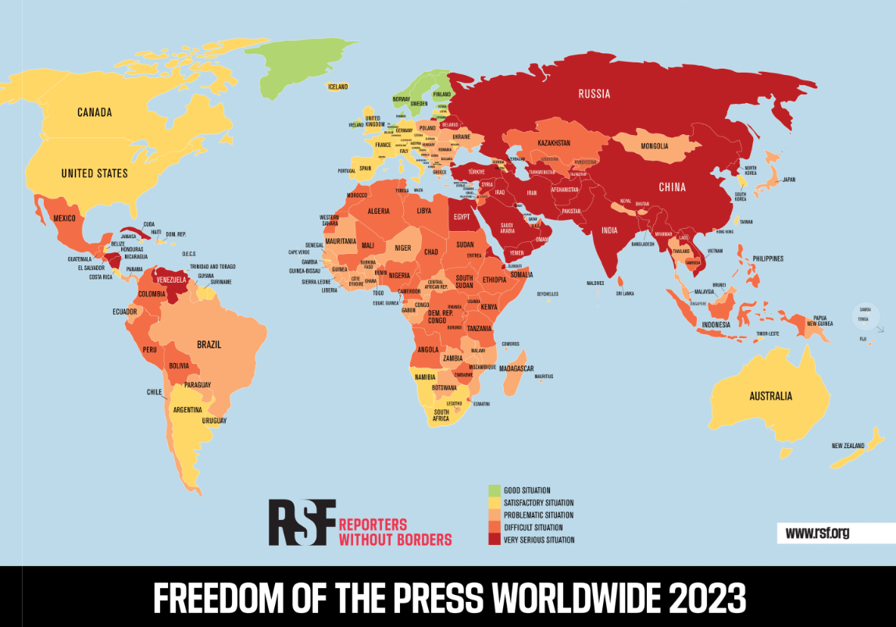 

---

class: inverse

Here are key takeaways about development:

--

- It is more than just economic growth (increases in income); it includes social progress like health, education, political participation, and environmental sustainability.

--

- Development means creating and utilizing economic, human, social, and financial assets to improve broadly shared well-being.

--

- Sustainable development focuses on meeting present needs without compromising future generations' ability to meet theirs, balancing economic, social, and environmental factors.

--

How do we measure development to assess progress and design effective interventions? 

---

class: inverse

While development includes many qualitative dimensions, **having standardized, quantifiable indicators** is essential for comparison across countries and over time. 

--

Two of the most widely used aggregate economic measures that provide insight into a country's overall economic performance and capacity to improve well-being are:

- Gross Domestic Product (GDP), and 

- Gross National Income (GNI).

---

# Measuring development

--

**GDP** (Gross Domestic Product): economic output generated by resident producers, regardless of ownership, within a country.

--

**GNI** (Gross National Income): total amount of factor incomes earned by the residents of a country.

--

$$\text{GNI} = \text{GDP} + \text{Income Earned By Residents from Abroad} - \text{Income Earned By Non-Residents Domestically}$$

--

These measures are expressed in monetary terms (commonly USD using **conversion factors**) for international comparability.

  - World Bank Atlas method and purchasing power parity (PPP) rates are two common factors.
  
  - These measures have their limitations, and do not capture the social/environmental dimensions.
  
---

# Purchasing power parity (PPP)

PPP allows us to compare the relative value of currencies by measuring the purchasing power of different countries’ currencies to buy the same **basket of goods and services.**

   

--

What are some problems with PPP? 

--
- Different baskets of goods: people consume different goods and services, so there is no truly comparable basket.

- Prices of non-tradable goods are services (e.g., housing) vary widely and are not internationally linked.

- Quality and measurement differences: differences in product quality, availability, and statistical methods can distort PPP estimates, etc.

---

# The World Bank Income Classifications

The World Bank classifies countries into income groups to better analyze development progress and target assistance.

--

Income groups are based on GNI per capita, calculated using the World Bank Atlas method, which smooths exchange rate fluctuations and inflation.

--

There are four groups:
  

  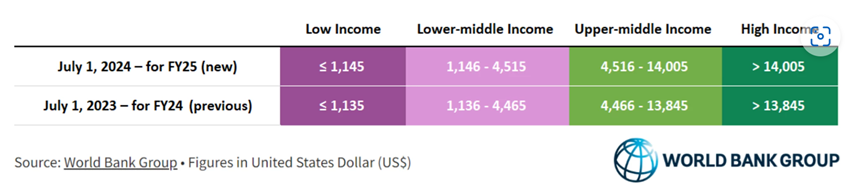 

---

# The World Bank Income Classifications

Look at the following graphics, what patterns do you notice on development progress?

  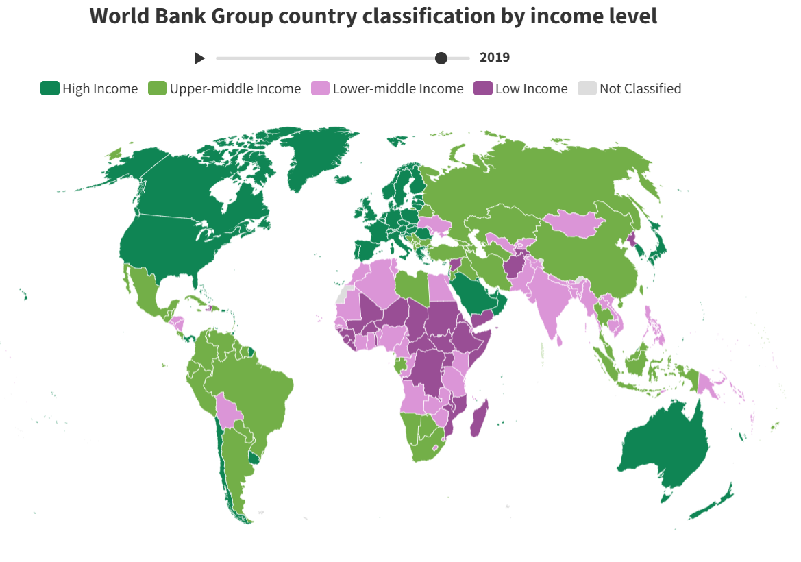  
  <a href="https://blogs.worldbank.org/en/opendata/world-bank-country-classifications-by-income-level-for-2024-2025">https://blogs.worldbank.org/en/opendata/world-bank-country-classifications-by-income-level-for-2024-2025</a>

---

# The World Bank Income Classifications

Significant Shift in Income Groups Over Time:

  - Since 1987, there has been a notable decrease in the share of low-income countries.
  
--

Regional Variations in Development Progress:

  - South Asia has dramatically reduced its low-income country share
  
  - Middle East and North Africa have seen some increase in low-income countries 
  
  - Latin America and the Caribbean have expanded their share of high-income countries significantly
  
--

Annual Reclassification Reflects Economic Growth and Recent Events:

  - For 2024-2025, West Bank and Gaza moved downward due to economic contractions caused by conflict.

---

class: inverse 

Why do we care so much about these economic growth and income measures?

--

Because, as we will see now, they are closely linked to people’s well-being.

--

Understanding this relationship helps us grasp why income classifications matter beyond just dollars and cents.

---

# Significant income differences across countries 

  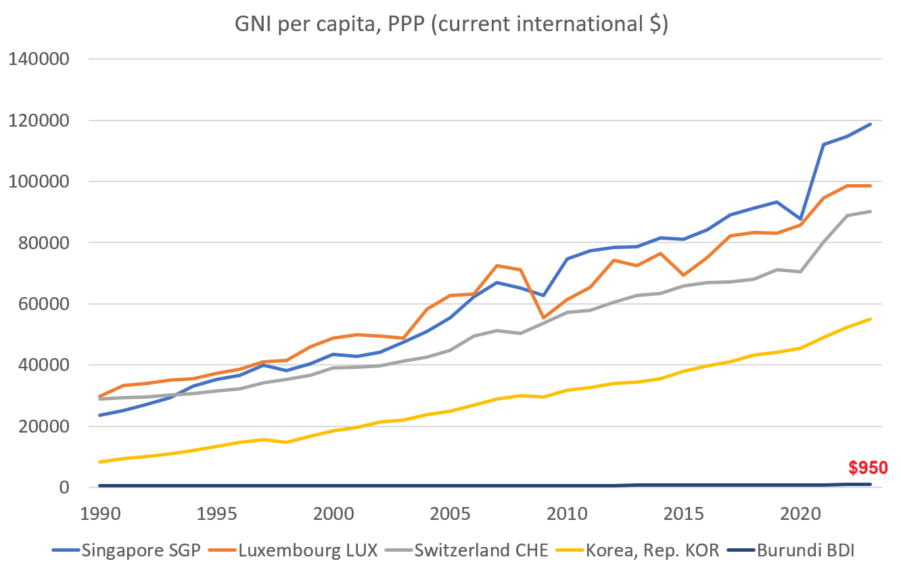 

---

# These income differences matter for infant mortality

Generally, higher income is associated with lower infant mortality.

  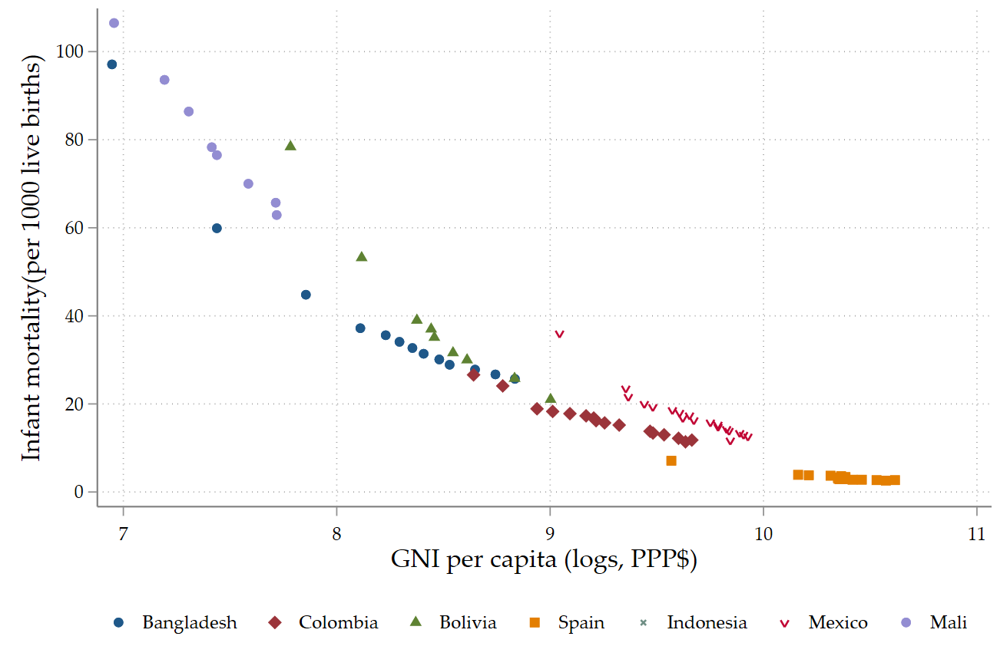 

---

# These income differences matter for life expectancy

Generally, higher income is associated with higher life expectancy.

  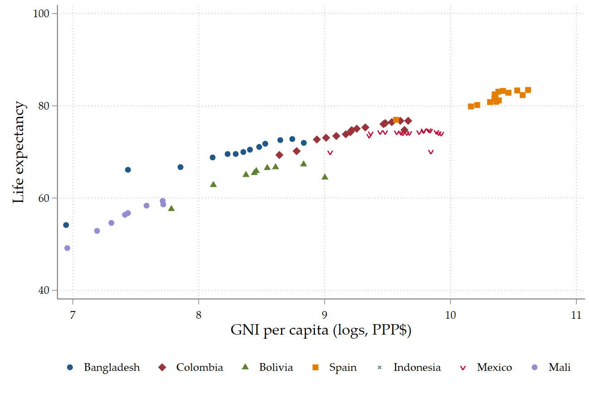 

---

# These income differences matter for literacy

Generally, higher income is associated with higher literacy.

  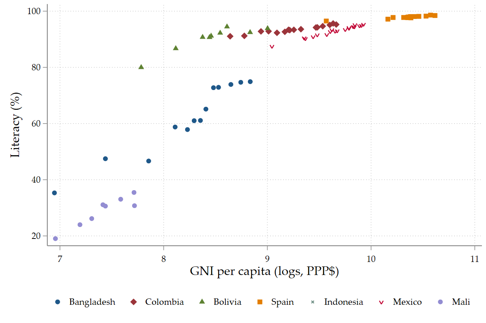 

---

# These income differences matter for literacy by gender

Generally, higher income is associated with lower gender gap in literacy.

   

---

# The challenge of poverty eradication

  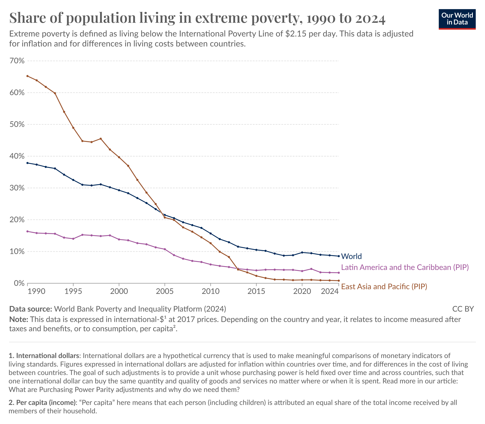 

---

# The challenge of poverty eradication

  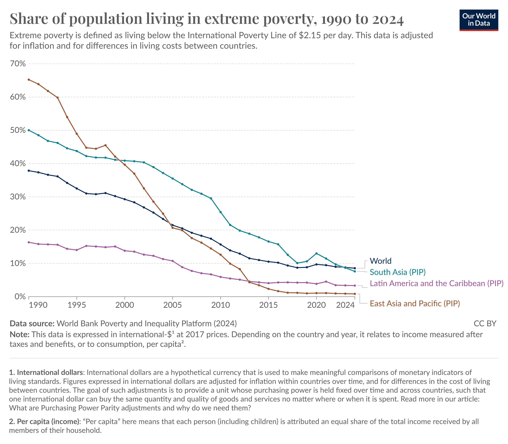 

---

# The challenge of poverty eradication

  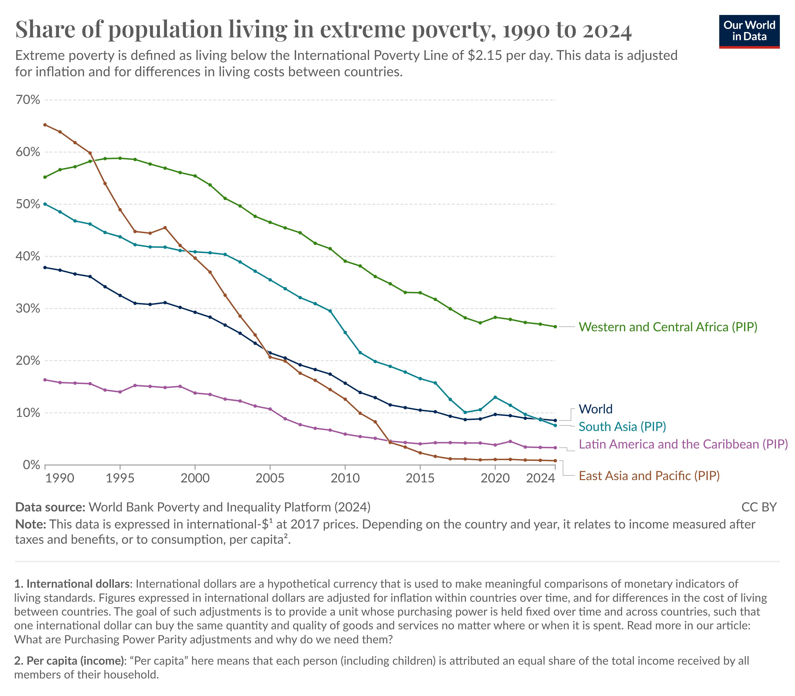 

---

# The challenge of poverty eradication

  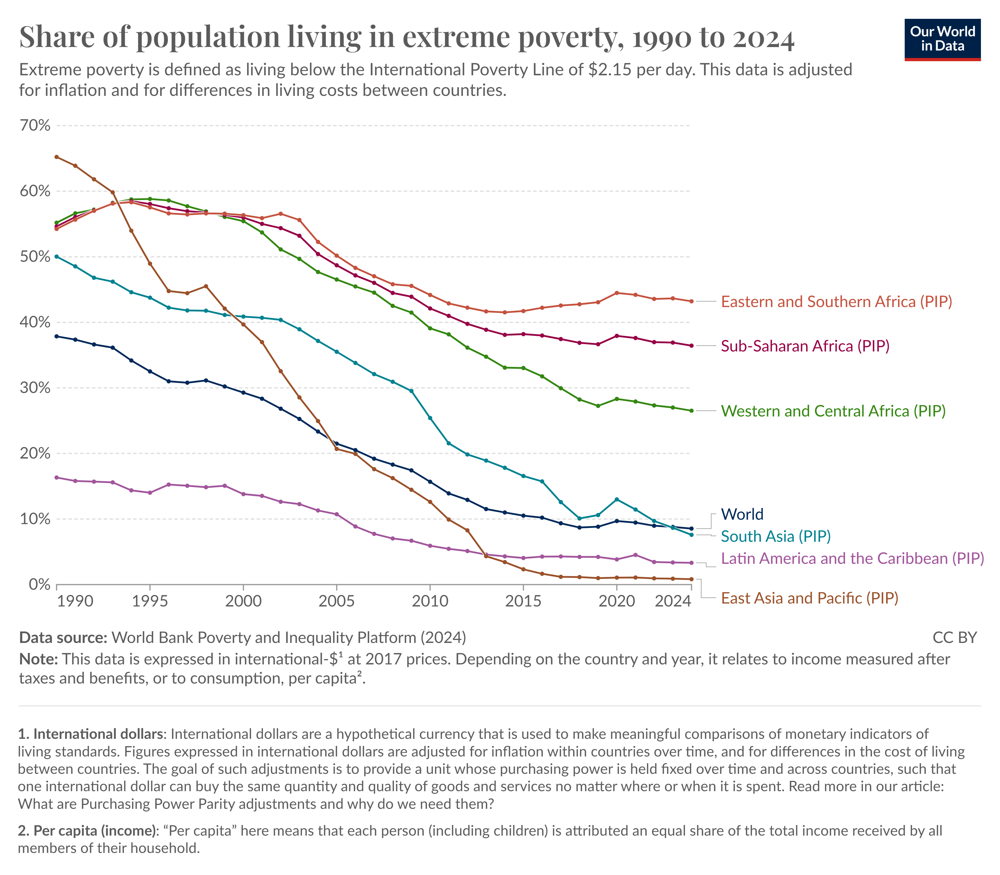 

---

class: inverse, middle, center 

# 

  What causes underdevelopment?  
  
  Or put it differently, what induces development?
  

 

---

# Alternative interpretations

**Jeffrey Sachs**: state planning is crucial for **multiple equilibria** coordination. e.g., **subsidies** can be effective, and a **big push** in foreign aid can help shift an economy from a low to a high development equilibrium.

--

**William Easterly**: skeptical of government and foreign aid, advocating instead for **small-scale, NGO-led projects** to identify effective solutions through experimentation.

--

**Daron Acemoglu** and **James Robinson**: emphasize the role of **institutions** in ensuring security, enforcing property rights, and fostering an inclusive market economy.

--

**Dani Rodrik**: rejects a one-size-fits-all approach, arguing that each country faces a **unique binding constraint**, challenging the Washington Consensus.

--

**Abhijit Banerjee** and **Esther Duflo**: advocate for a deeper understanding of poverty by providing better choices for the poor, stress the **importance of impact evaluation**, particularly through randomized controlled trials (RCTs).

---

# Social experiments to fight poverty

  <a href="https://www.ted.com/talks/esther_duflo_social_experiments_to_fight_poverty">https://www.ted.com/talks/esther_duflo_social_experiments_to_fight_poverty</a>

--

Rather than relying solely on broad theories or assumptions, recent approaches use **evidence-based solutions tailored to the specific challenges faced by the poor**. 

--

This method helps policymakers and NGOs identify effective programs, scale successful initiatives, and avoid wasting resources on ineffective ones.

--

Esther Duflo’s work exemplifies the shift toward **careful impact evaluation**, which will be a key theme in this course as we explore how to design, test, and learn from development policies on the ground.

---

class: inverse

You have seen that development is a multifaceted process, with income playing a major role in shaping many development outcomes.

--

Given the vast scope of development, we cannot cover every aspect comprehensively.

--

Instead, we will focus on selected key themes and policy challenges, using rigorous impact evaluation methods to gain deep insights into core areas of development policy.

---

class: inverse, middle, center

# 

  Course overview and some logistics

 

---

# Course snapshot 

**Week 2: Poverty: Concepts and Measurement**

  - We will learn about definitions and measurement of poverty

  - We will have a gentle introduction to data collection and analysis

--

**Week 3: Stata Basics for Data Analysis**

  - Introduction to Stata 
  
  - Hands-on practice with poverty data
  
--

**Week 4: Evidence-based Policy: Why Data Matters**

  - What is evidence-based policy?
  
  - Basic introduction to causality: correlation vs. causation
  
  - Counter-factual thinking
  
---

# Course snapshot 

**Week 5: Impact Evaluation**

  - Why evaluate the impact?
  
  - Introduction to common impact evaluation methods: Randomized Controlled Trials and Difference-in-Differences
  
--

**Week 6: Social-Assistance Programs**

  - Social-assistance policies and their impact
  
--

**Weeks 7-8: Human Capital: Education and Health**

  - What determines schooling decisions and health outcomes?
  
  - We will focus on empirical causal evidence of policies/interventions that have been shown to be effective in some settings.
    
---

# Course snapshot

**Week 9: Labor and Migration**

  - What makes people enter the labor markets? what causes them to migrate?
  
  - What are the impacts of migration on origin and destination places?

--

**Week 10: Sustainable Development**

  - What is the relationship between economic growth and the environment?
    
  - What can we do to minimize the adverse impacts of economic development/growth on the environment?

---

# Some logistics

- **Class schedule**: Mondays and Wednesdays, 14:40-16:20

- **Office hours**: Fridays, 15:00-17:00

  - This is your time to ask questions about the course material—no question is too small.
  
  - If the available slots do not work for you, email me: tpham@kdischool.ac.kr
  
  - I won’t be answering course questions over email, so office hours are the best way to get help.
  
- **Class assistant**:

  - AAAA is your go-to person for class cancellations or makeup sessions.

- **Textbook**: *Development Economics: Theory and Practice* by Alain de Janvry and Elisabeth Sadoulet
  
---

# Grading: 3 components

**Reading Assignment and Class Participation (10%)**

  - You are expected to arrive on time and complete the assigned readings before each class.
  
  - When possible, I will post the required readings on the course website.
  
--

**Three Problem Sets (50%)**
  
  - **Problem set 1 (individual, 15%)**: Introduction to Stata and basic analysis using poverty data.
  
  - **Problem set 2 (group, 17.5%)**: Analysis of a development policy intervention using real-world data.
  
  - **Problem set 3 (group, 17.5%)**: Critical reading and interpretation of causal evidence on development outcomes.
  
--

These assignments combine quantitative analysis with conceptual questions to reinforce key theories and methods. 
  
  - They are designed to offer hands-on practice and build confidence in applying economic tools to real-world development policy issues.

  - Group work will be completed in teams of 3-5 students, selected by students. Individual contributions will be assessed through peer evaluations.

---

# Grading: 3 components

**Final Exam (40%)**

  - **In-class Exam (20%)**: A 90-minute closed-book exam focused on key concepts, theoretical frameworks, and policy applications.
  
  - **Take-home Exam (20%)**: A data analysis assignment that applies methods covered in the course. It will be distributed after the in-class exam and is due in 72 hours.
    
--

**Late Policy**

  - Late submissions will incur a penalty of 10% per day, including weekends. 
  
  - Exams submitted more than three days late will receive a zero unless prior approval is granted due to exceptional circumstances.
  
--

**Collaboration Policy**

  - Individual Problem Set and Take-Home Exam must be completed individually. 
  
  - While you may discuss general concepts with peers, all code, analysis, and written answers must be your own original work. Sharing of code or written answers is strictly prohibited and will be treated as academic misconduct.

---

# How to succeed in this course?

**Engage Thoughtfully**: Participate in discussions, ask questions, and contribute insights analytically and thoughtfully based on readings and lectures.

**Stay Current**: Keep up with assigned readings, case studies, and current global development news to connect theory with practice.

**Think Critically**: Evaluate different perspectives on development challenges and policy solutions with an open and analytical mindset.

**Apply Concepts**: Practice applying methods like impact evaluation and data analysis to real-world development problems.

**Collaborate and Respect**: Listen actively to peers, build on their insights, and foster a respectful learning environment.

**Seek Help**: Ask for help when needed to deepen understanding.

---

class: inverse, middle, center

# 

  Do you have any questions? 

 

---

# Plan for next week

**Monday**: Measurement of Poverty: [JS] Chapter 5

  - Sections: characterize welfare, choose a poverty line, describe poverty, measure poverty

**Wednesday**: Poverty Traps: [JS] Chapter 5

  - Sections: dynamics of poverty, poverty traps
  

---

class: inverse, middle, center

# 

  Thank you!

 

