# Plan for this week

Poverty remains one of the most pressing challenges in development policy, affecting billions worldwide.

--

Understanding **how poverty is measured** helps us grasp its scale, characteristics, and who is most affected.

--

A clear **poverty profile** and **indicators** enable targeted and effective policy interventions.

--

Exploring **poverty traps** will reveal why escaping poverty is difficult for many and the role of policy in breaking these cycles.

--

This lecture begins by unpacking the concepts and tools used to measure and analyze poverty critically.

---

class: inverse, middle, center

# 

  Motivation

 

---

# Motivation

Reducing poverty and hunger is likely to be the most widely shared development objective.

--

   
  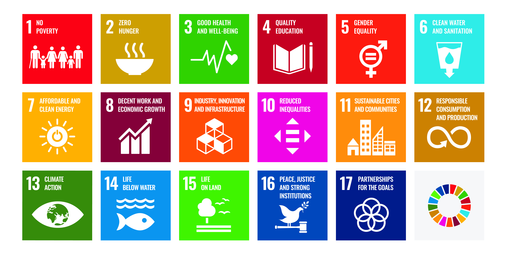 

---

# Motivation

How do we characterize and explain poverty through diagnostics & identification of causal determinants? 

--

What can be done to reduce poverty using well designed and targeted policies and programs?

--

To answer these questions, we need to first agree on: 

  - the choice of a monetary indicator of wellbeing that can be used to characterize poverty
  
  - a poverty line, below which the poor will be found
  
  
---

class: inverse, middle, center

# 

  Poverty Measurement

 

---

# Poverty Measurement 

There are two monetary indicators we could use to measure an individual’s level of wellbeing at a particular point of time:

--

  - income per capita 
  
--

  - consumption expenditure per capita
  
--

Which do you think is better indicator of wellbeing?

--
consumption

--
, because:

--

  - Consumption is closer to wellbeing as it creates utility, while income *per se* does not.
  
--

  - Consumption is easier to measure and more likely to be constant across time ("consumption smoothing").
  
---

# Consumption vs. Income 

Individuals attempt to smooth consumption across years when income fluctuates. 

--

Consumption is also smoothed across the life cycle:

  - exceeding income in youth, falling behind income at working age, and exceeding income again in old age.

  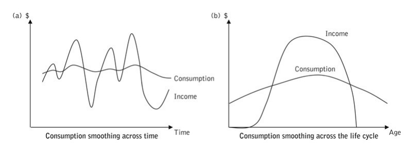 

---

# Difficulties in using consumption 

Information on consumption expenditures is generally **not available for individuals** but for households.

--

**Measurement errors**: How you would answer questions about how much you spent 

  - food during the last week, utilities during the last month, durable goods during the last year
  
--

**Preference**: consumption expenditures vary with tastes

  - difficult to make inter-personal comparisons of wellbeing.
  
--

**Durable goods expenditure**: required different information to estimate 

  - price of asset, lifespan, depreciation rate, opportunity cost of capital.
  
--

**Consumption smoothing ability**: households are differentially able to smooth consumption

  - creating differences in consumption across households by ability to smooth.
  
---

# Household vs. Individual wellbeing

Due to data limitations, consumption is often measured at the household level rather than individual level. 

--

To calculate per capita consumption, we need to adjust for *differences in household demographics.* 

--

Let $n^{*}$ be the number of "equivalent adults" in the household. 

--

For each category $k$, the number of individuals is multiplied by a relative weight for that category $w_k$.

$$n^{*} = \sum_k w_k n_k$$
  
  - In OECD scale, adult males are given weight 1, adult females: 0.7, children: 0.5.  

  - In WB LSMS scale, adults above 17: 1, children 13-17: 0.5, children 7-12: 0.3, children 0-6: 0.2.

Example: a household with 1 adult male, 1 adult female, 1 child of 7 years old, and 2 children of 2 years old:

--

  - In OECD scale, the number of equivalent adults would be: $1*1 + 0.7*1 + 0.5*1 + 0.5*2 = 3.2$.

  - In WB LSMS scale, the number of equivalent adults would be: $1*1 + 1*1 + 0.3*1 + 0.2*2 = 2.7$.
  
---

class: inverse

Now that we have agreed upon measures of wellbeing, how can we separate the poor from the non-poor? 

--

We need poverty lines.

---

# Poverty lines 

We need to choose a threshold level $z$ ("poverty line") of $y$ (income/consumption) to decide who is poor and non-poor.

--

This is quite difficult because there is no agreement on the definition of poverty, or on what would be a threshold for a given poverty concept.

--

A few things to note regarding poverty and poverty lines:

--

  - Any statement about poverty is **relative to the choice of a poverty line**; no possible absolute statement about poverty. 
  
--

  - Because no agreement on a single poverty line, **it is often best to use several clearly defined alternative poverty lines**.
  
--

  - **Consistency should be maintained in the definition of a poverty line** when comparisons are made across time, geography, or subsets of a population.
  
    - If the poverty line changes too much or is defined differently, it becomes hard to tell if poverty has really increased or decreased, or if differences between places or groups are real or just due to different measurement methods.
    
    - Poverty lines are sometimes adjusted carefully to reflect changes in prices and the cost of living. 

---

# Example: Nutrition-based poverty line

  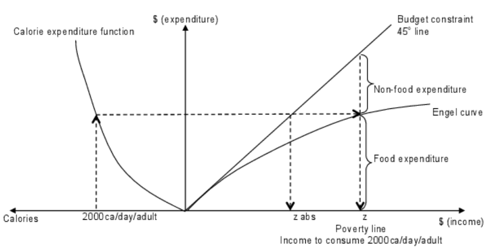 

- Left Panel: The calorie expenditure function relates calories purchased to a level of food expenditure.

--

  - Decreasing returns because consumers buy more expensive sources of calories as expenditure rises.
  
--

- Right Panel: The Engel curve traces the level of food expenditure as income (or total expenditure) rises.

---

# Example: Nutrition-based poverty line

   

- Normal poverty line $z$: expenditure level necessary to consume the recommended minimum calorie intake and non-food expenditures normally associated with that of food.

--

- Absolute poverty line $z_{abs}$: monetary cost of the recommended minimum calorie intake. 

---

# Other poverty lines

**Relative poverty line**: based on the mean income/consumption of a population.

  - People attach value to their income or consumption in relation to the mean in their country or community of residence. 
  
  - The relative poverty line can be interpreted as the cost of social inclusion: it is the level of expenditure necessary to participate with dignity in customary social and economic activities. 
  
--

**Subjective poverty line**: based on stated preferences.

  - "What expenditure do you consider to be absolutely minimal?" 
  
  - Those with actual expenditure lower than the stated subj. minimum would be considered poor.
  
--

**International poverty line**: used for international comparisons by the World Bank in the World Development Indicators. 

---

# Poverty lines in different countries

  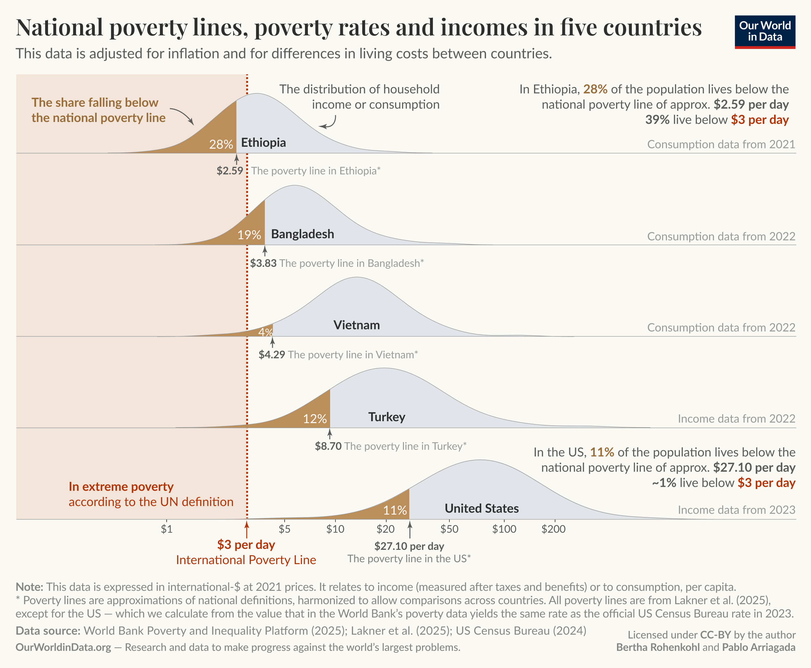 

---

class: inverse, middle, center

Now that we have established a poverty line, how do we characterize or describe the poverty situation?

--

We use **poverty profile** and **poverty indicators**.

---

# Poverty profile

Suppose we have a household survey that gives us the per capita expenditure level $y_i, i = 1, …, n$ for each of the $n$ members of a representative sample of the population. 

--

We can rank these $n$ individuals by increasing level of expenditure, from the poorest to the richest.

--

And draw this poverty profile:

  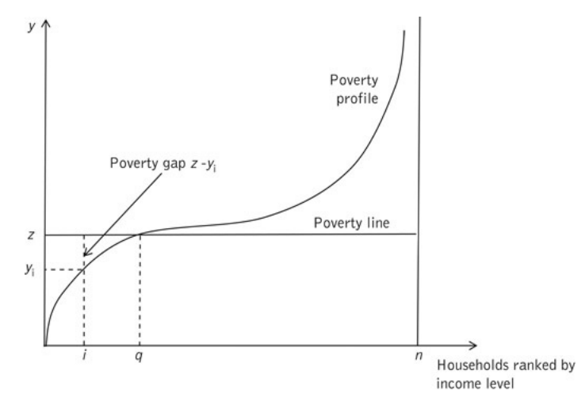 

---

# Poverty profile 

   

We also have a poverty line $z$. 

--

If we compare $y_i$ to $z$, we find that $q$ individuals have $y_i < z$, i.e., are in poverty.

--

Poverty gap $z - y_i$ for each poor person $i < q$ tells us how much expenditure the individual needs to get out of poverty.

---

# Poverty profile: group discussion

Suppose we have a population of 20 people, in which:

  - 10 people have expenditure of 5.
  
  - 5 people have expenditure of 6.
  
  - 3 people have expenditure of 7.
  
  - 2 people have expenditure of 10.
  
Also assume that the poverty line is 5. 

Draw the *poverty profile*, and briefly discuss the *poverty gaps* for each group.

---

# Poverty indicators

Poverty profile can be summarized with a few scalars that are easy to measure and communicate.

--

Foster, Greer, and Thorbecke (FGT) proposed the following formula (don’t worry if it looks a bit intimidating at first!)

--

$$P^{\alpha} = \frac{1}{n}\sum_{i=1}^{q}(\frac{z - y_i}{z})^{\alpha}$$

where $n$ is the population, $q$ is number of people below the poverty line $z$, and $y_i$ is their expenditure.

--

- $\alpha = 0, P^0 = \frac{q}{n}$: headcount ratio (incidence of poverty, poverty rate): 
--
does not tell us how poor the poor are.

--

- $\alpha = 1, P^1 = \frac{\sum_{i=1}^q(z-y_i)}{nz}$: poverty gap index (depth of poverty)

  - If we can perfectly target the poor, $\sum_{i=1}^q(z-y_i)$ is the cost of eliminating poverty.
  - If not, $nz$ is the cost of eliminating poverty.

--

- $\alpha = 2, P^2 = \frac{1}{n}\sum_{i=1}^{q}(\frac{z - y_i}{z})^{2}$: severity of poverty index (inequality of poverty)

  - This gives greater weight to expenditure deficits further away from the poverty line.

---

# Poverty indicators: illustration

Suppose we have a population of 20 people, in which:

  - 10 people have expenditure of 5.
  
  - 5 people have expenditure of 6.
  
  - 3 people have expenditure of 7.
  
  - 2 people have expenditure of 10.
  
Also assume that the poverty line is 5. How can we illustrate the three poverty indicators?

---

class: inverse, middle, center

# 

  What is the relationship between poverty profile and poverty indicators?

 

---

# Poverty profile and indicators

When poverty profile shifts to the left:

  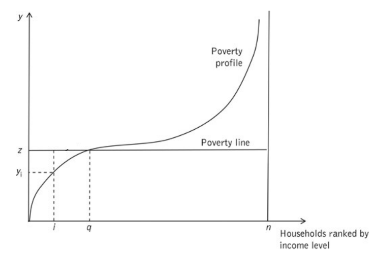 

---

# Poverty profile and indicators

When poverty profile shifts to the left:

  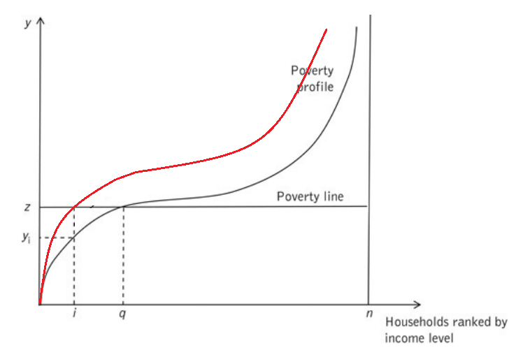 

--

- Poverty incidence/poverty rate $P^0$ is lower.

- Poverty gap index $P^1$ is lower.

- Poverty severity index $P^2$ is lower.

---

# Poverty profile and indicators

When profiles intersect at $q$, but shift to the left below the poverty line:

   

---

# Poverty profile and indicators

When profiles intersect at $q$, but shift to the left below the poverty line:

  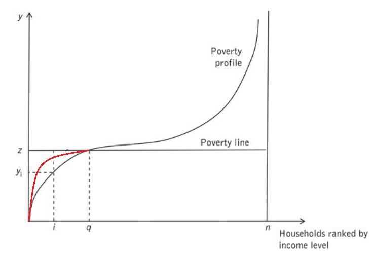 

--

- Poverty incidence/poverty rate $P^0$ remains constant.

- Poverty gap index $P^1$ is lower.

- Poverty severity index $P^2$ is lower.

---

# Poverty profile and indicators

When profiles intersect below the poverty line, but the green area is equal to the blue area:

   

---

# Poverty profile and indicators

When profiles intersect below the poverty line, but the green area is equal to the blue area:

  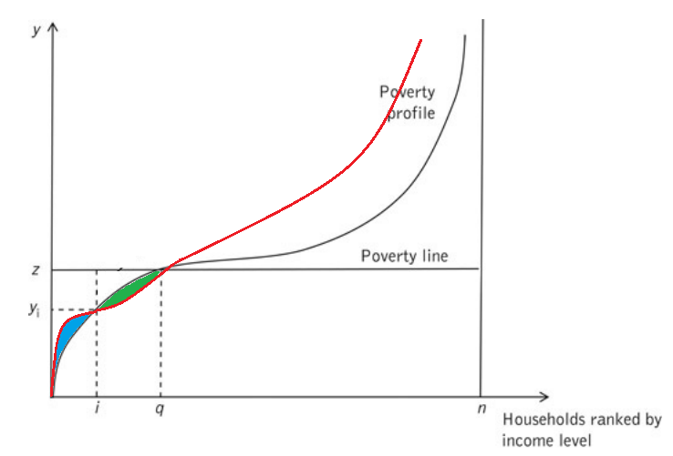 

--

- Poverty incidence/poverty rate $P^0$ remains constant.

- Poverty gap index $P^1$ remains constant.

- Poverty severity index $P^2$ is lower.

---

class: inverse

Now that we have a poverty profile of the population, let's have some thought experiments on whom we should target to minimize the three poverty indicators.

--

In particular, whom should we target to minimize:

  - the poverty rate $P^0$
  
  - the poverty gap index $P^1$
  
  - the poverty severity index (i.e., poverty inequality) $P^2$

---

# Policy implications: poverty reduction

With a given budget, whom should we target to **minimize the poverty rate** $P^0$?

  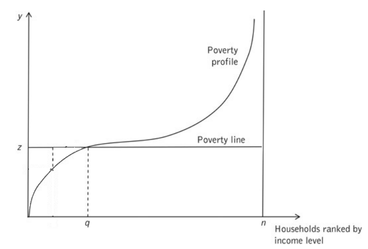 

---

# Policy implications: poverty reduction

With a given budget, whom should we target to **minimize the poverty rate** $P^0$?

  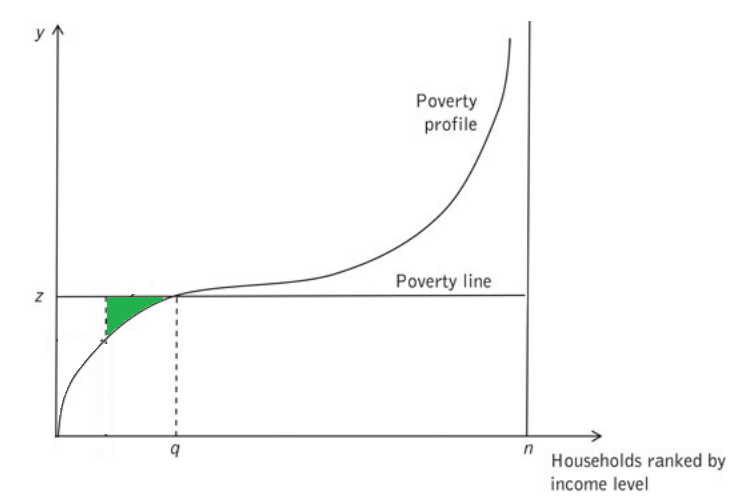 

--

To minimize the poverty rate, i.e., reduce the number of poor people

  - we start **spending on the least poor** until the budget is exhausted.

---

# Policy implications: poverty reduction

With a given budget, whom should we target to **minimize the poverty gap index** $P^1$?

   

---

# Policy implications: poverty reduction

With a given budget, whom should we target to **minimize the poverty gap index** $P^1$?

   

--

Because a dollar-of-poverty gap is the same across all poor, there is no general rule.

---

# Policy implications: poverty reduction

With a given budget, whom should we target to **minimize the poverty severity index** $P^2$?

   

---

# Policy implications: poverty reduction

With a given budget, whom should we target to **minimize the poverty severity index** $P^2$?

  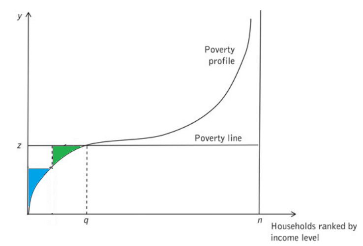 

--

To minimize the poverty severity index, i.e., reduce the inequality of poverty

  - We start spending on the poorest until the the budget is exhausted.

---

class: inverse

Note that poverty is a dynamic condition and we may observe high mobility in and out of it: 

--

  - some people fall into poverty,
  
--
  
  - some escape from poverty,
  
--
  
  - and others are *forever trapped* in poverty (we will come back to this point later).
  
--

For this reason, the overall poverty rate may be misleading. 

--

We may have had no change in poverty rate $P^0$ over a certain period of time and yet many people may have moved into and out of poverty during the period.

--

Shocks can significantly impact a household’s expenditure level, affecting its vulnerability to poverty.

---

# Shocks and poverty

Shocks can be broadly categorized into two groups:

--

  - **Idiosyncratic shocks**: affect only a single household or individual 
    - e.g., illness, job loss, or the death of a household member

--

  - **Covariate shocks**: impact entire communities, regions, or even countries 
    - e.g, drought and flood, recession, policy changes, political cycles

--

Do you think people use the same ways to cope with different kinds of shocks (coping mechanisms)?

--

Different types of shocks have different risk coping mechanisms:

--

  - Idiosyncratic shocks can often be managed locally through informal mutual insurance networks 
  
    - e.g., community savings groups or extended family support
    
--

  - Covariate shocks are harder to insure locally and often require external interventions
  
    - e.g., government safety nets, international aid
    
---

class: inverse

So far, we’ve focused on measuring poverty—using statistics to understand who is poor based on past and present data.

--

However, governments and development agencies need to know who is **at risk of becoming poor in the future**, not just who is poor today.

--

That will allow governments and policymakers to design **prevention strategies**—not just responses—so they can support those at risk before poverty happens.

--

This means asking: Who are the households or individuals **vulnerable to poverty**?

---

# Vulnerability to poverty

Vulnerability to poverty is a probabilistic statement about the future.

--

"What is the likelihood that my future expenditures will fall below the poverty line?"

--

Household $i$'s vulnerability can be expressed as $v_{it} = \Pr(y_{i, t+1} < z)$

  - A household is vulnerable if its level of vulnerability, $v_{it}$, is greater than a given vulnerability line, $\alpha$.
  
--

Important vulnerability thresholds are $\alpha = 0.5$ and $\alpha = P^0$.

  - Vulnerable households: $v_{it} \geq \alpha$
  
  - Highly vulnerable households: $v_{it} \geq 0.5$
  
  - Moderately vulnerable households: $v_{it} \geq P^0$
  
  
---

# Types of poverty

Using the concept of vulnerability to poverty, we can classify people into 4 categories:

  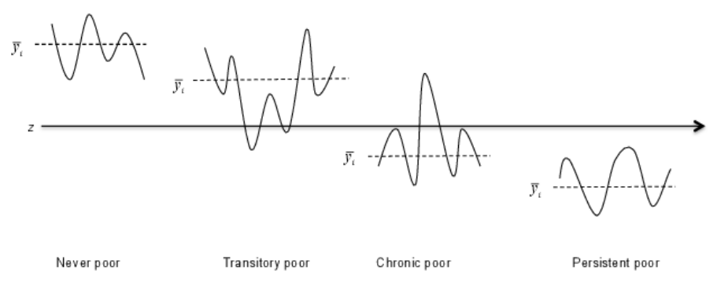 

- The **transitory poor** have expenditures above the poverty line on average, but sometimes fall below it. 

  - normally non-poor HHs that are vulnerable to poverty can fall into it as a consequence of a shock.
  
--

- The **chronic poor** have expenditures that are on average below the poverty line, but sometimes exceed it.

--

- The **persistent poor** are those who are always below the poverty line.

---

class: inverse

Having explored poverty measurement and coping strategies, it is important to understand the different ways people and economies can escape poverty. 

--

There are two contrasting perspectives on how this process unfolds.

--

We have the poverty trap model and no-poverty-trap model.

---

# Two roads out of poverty

  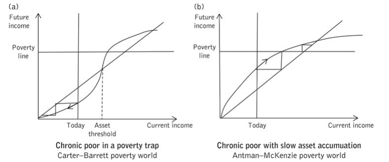 

--

**Left panel: poverty trap exists** (multiple-equilibrium framework)

  - People are stuck in a low-income equilibrium
  
  - This is a threshold that must be overcome through a significant, coordinated "big push," (e.g., a large investment or aid influx), to generate enough income to rise above poverty

--

**Right panel: no poverty trap exists** (decreasing-returns framework)

  - Individuals can gradually accumulate assets and increase their income step-by-step until they cross the poverty line.
  
---

class: inverse

Which of these two pathways do you think best explains how people escape poverty in the real world?

--

- The big push needed to overcome a poverty trap,

- Or gradual, steady progress without a strict threshold?

--

Balboni et al. (2022) provides one of the first rigorous evidence that **poverty trap does exist**.

---

# Balboni et al. (2022)

They attempted to distinguish two views on "Why are the world's poor employed but have low earnings?"

--

  - View 1: the poor have the same opportunities as everyone else, there are traits that make them unsuitable for other occupations
  
    - i.e., there is no poverty traps and thus even with "big push" policies, they will return to where they started
  
--

  - View 2: the poor face different opportunities and take low-earning jobs because they are born poor
  
    - i.e., there are poverty traps and "big push" policies could elevate them out of poverty forever
    
--

The authors show that poverty is not just about low income but also about obstacles that prevent people from moving past a critical threshold.

--

Their analysis reveals persistent patterns of poverty where those below the threshold struggle to accumulate assets to escape.

---

# Balboni et al. (2022)

  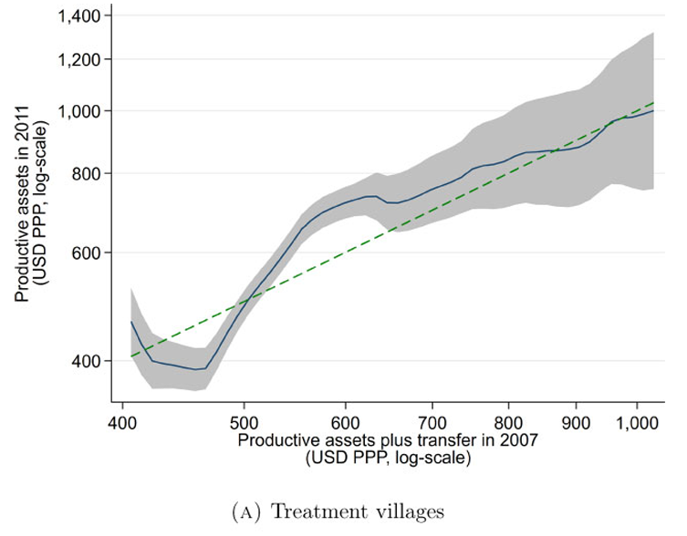 

This shows what happened when people received a transfer to boost their productive assets (like livestock).

--

  - Notice that for people who started with lower assets in 2007, their assets in 2011 barely increased. 

  - But for people who started with more, their assets rose much more quickly. 

--

The curve bends upward, showing that crossing a certain threshold leads to much faster progress—a sign of a “poverty trap.”

---

# "The welfare trap"

  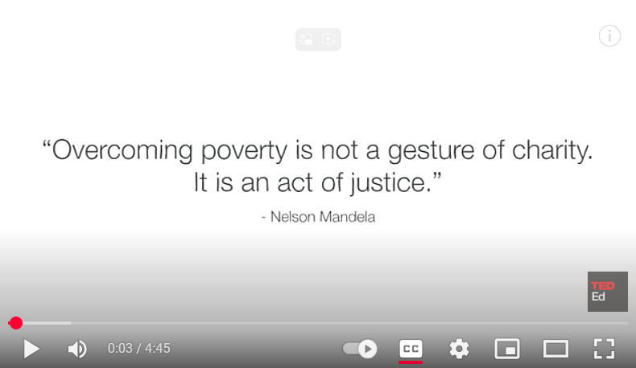  
  <a href="https://www.youtube.com/watch?v=D9N7QaIOkG8">https://https://www.youtube.com/watch?v=D9N7QaIOkG8</a>

---

# Discussion

- What is a poverty trap, and how does the welfare trap described in the video fit into this idea?

  - Can you think of other examples of poverty traps besides welfare programs?
  
- How do government benefit programs sometimes unintentionally keep people in poverty?

  - What are the challenges of designing programs that support the poor without discouraging work?
  
- How does the concept of vulnerability to poverty apply to people affected by welfare traps?

  - Who is most at risk of falling back into poverty if assistance is withdrawn?
  
- How does the poverty measurement (e.g., headcount, poverty gap, severity) help us understand which groups are affected by welfare traps?

  - Would changing how we measure poverty help us design better programs?

---

# Main takeaways

- Poverty is multidimensional, but measuring it through income or consumption relative to a clearly defined poverty line helps quantify who is poor and how deep poverty is.

--

- The FGT poverty indicators $(P^0, P^1, P^2)$ capture different aspects of poverty—from simply counting the poor to measuring the depth and severity of poverty.

--

- People face different coping mechanisms depending on the types of shocks they encounter; understanding these is key for designing effective support.

--

- There are two main perspectives on escaping poverty:

  - The poverty trap model that requires a "big push" investment to cross a threshold.
  
  - The gradual progress model with steady accumulation of assets and income.
  
--

- Empirical evidence (e.g., Balboni et al. 2022) supports the existence of poverty traps, showing that significant barriers keep people locked in poverty unless these thresholds are overcome.

--

- Policy implications: Breaking poverty traps requires targeted, substantial interventions rather than only incremental steps.

---

class: inverse, middle, center

# 

  Do you have any questions? 

 

---

# Plan for next week

Next week, we will learn about data concepts, with a specific focus on poverty-related data.

--

Required reading: Executive Summary and Introduction of the following World Bank document on food data collection in household surveys:

 <a href="https://documents1.worldbank.org/curated/en/793601587034078451/pdf/Food-Data-Collection-in-Household-Consumption-and-Expenditure-Surveys-Guidelines-for-Low-and-Middle-Income-Countries.pdf">https://documents1.worldbank.org/curated/en/793601587034078451/pdf/Food-Data-Collection-in-Household-Consumption-and-Expenditure-Surveys-Guidelines-for-Low-and-Middle-Income-Countries.pdf</a> 

You don’t need to read every detail but try to familiarize yourself with the main concepts and challenges.

--

Whenever you have time, please consider watching this introductory video to get familiar with basic terminology, statistics, and the software we will be using in this class:

 <a href="https://www.youtube.com/watch?v=gdnDkjoPJTM">https://www.youtube.com/watch?v=gdnDkjoPJTM</a> 

--

Please note that hands-on practice with Stata will take place during practical lab sessions led by the TA.

  

---

class: inverse, middle, center

# 

  Thank you!

 

