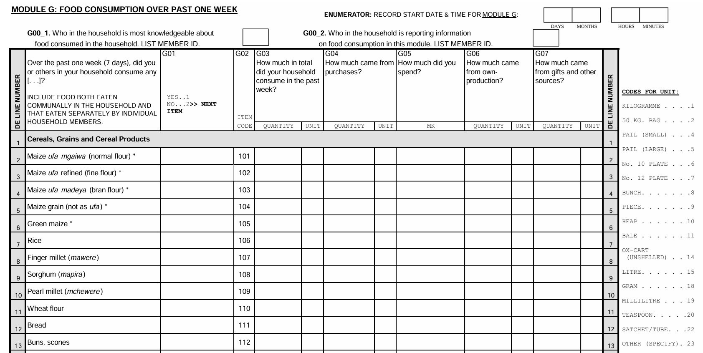
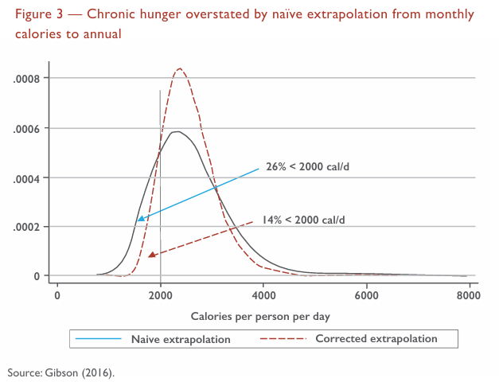
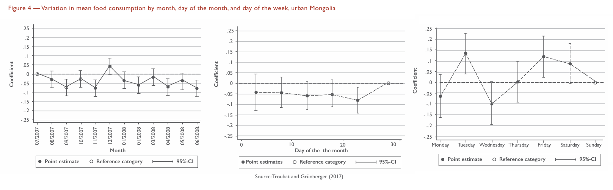
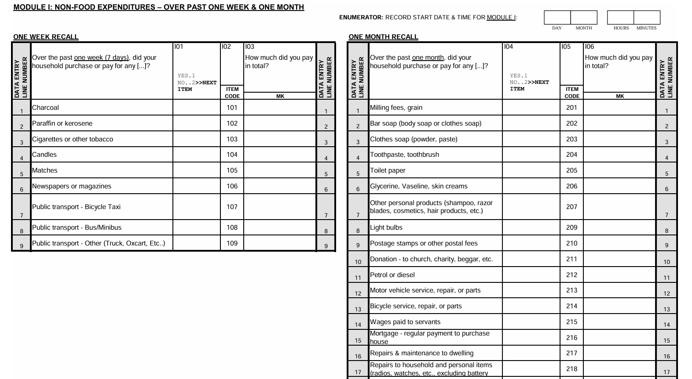
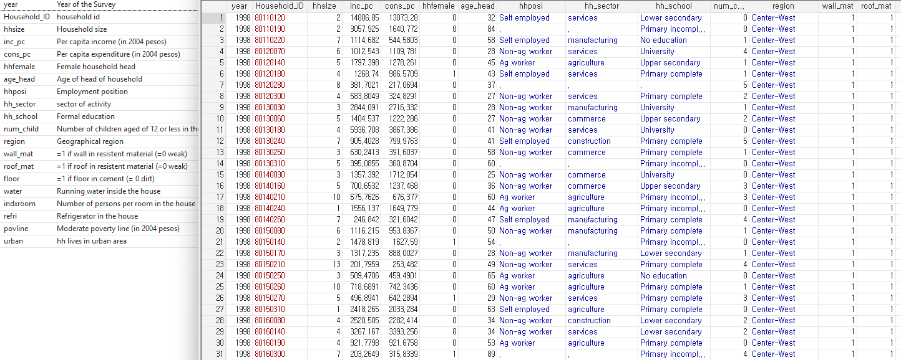
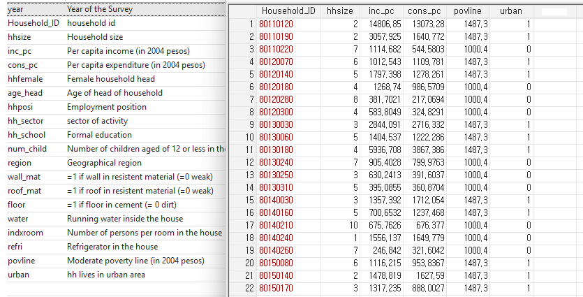
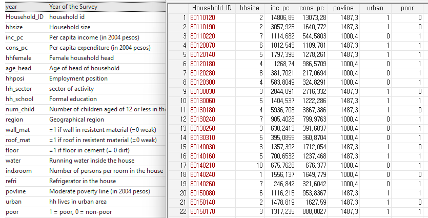
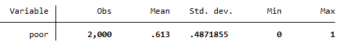

# Plan for this week

- **Data collection** is fundamental for measuring and understanding social and economic realities.

--

- Using **poverty data** as an example, we’ll explore the structure and key variables that underpin meaningful analysis.

--

- You’ll learn basic **descriptive statistics** to summarize and interpret data effectively.

--

- An introduction to the **Stata interface and workflow** will demonstrate how to analyze data efficiently and reproducibly.

--

- **Hands-on practice** during TA sessions will give you the opportunity to apply these skills with real poverty datasets.

---

class: inverse, middle, center

# 

<div style="font-size: 28px; text-align: center;">
  Data Concepts: A Focus on Poverty Data
</div> 


---

# Why data?

- Data is essential for **understanding the true scale and nature of poverty**—who is poor, how poor, and where.

--

- Reliable data enables policymakers and development agencies to **design effective, targeted interventions**.

--

- Without data, efforts to reduce poverty are based on guesswork rather than evidence.

--

- Household surveys and statistical measurements give us a **clear picture of poverty dynamics and changes over time**.

--

- Data-driven insights help track progress, identify vulnerable groups, and allocate resources efficiently.

--

- How do you think poverty data are collected?

---

# How poverty data are collected?

The primary method is **household surveys**, where selected households are interviewed about income, expenditure, and living conditions.

--

Surveys use **sampling methods** to represent the entire population without surveying everyone.

--

Questions cover topics like food consumption, housing expenses, education, healthcare, and asset ownership.

--

Data is often collected based on **specific recall periods** (e.g., last week, last month) to improve accuracy.

--

Ensuring data quality involves carefully designing surveys and training enumerators to reduce errors.


---

class: inverse, middle

I’d like to ask you some questions—please answer them as best as you can.

--

Over the past 7 days, how many meals did you eat that included rice?

--

Can you estimate the total amount of rice (in cups, bowls, or grams) you consumed during those meals?

--

How do you think your estimate would differ if asked about 30 days instead of 7 days?

--

We will look at some specific household survey questionnaires and discuss potential issues with them.


---

# Example of household surveys

<div style="text-align: center;">
   <br>
  <a href="https://www.worldbank.org/en/programs/lsms">https://www.worldbank.org/en/programs/lsms</a>
  </div> 
  
- The survey collects data on income, expenditure, health, education, and assets in many developing countries. 

---

class: inverse

Next, I will show you an example: the Malawi Fourth Integrated Household Survey, part of LSMS.

--

Let's discuss the following questions:

- What information is this survey collecting from households?

- Why are there separate columns for purchases, own production, gifts, and other sources?

- What challenges arise in accurately reporting how much was consumed or spent?

- What problems might occur if respondents forget details about food items or quantities in the past week?

- How might using different units (e.g., kilogram, pail, bunch) cause errors or confusion?

- Could answers vary depending on who in the household responds?

- How might local food customs or sharing affect data accuracy?


---

# Malawi Fourth Integrated Household Survey

<div style="text-align: center;">
   
</div> 


---

class: inverse, middle, center

# 

<div style="font-size: 26px; text-align: center;">
  From this example, what do you think are the challenges with this type of surveys?
</div> 


  
---

# Challenges with food consumption surveys

**Recall bias**: Respondents may forget or misreport food consumed, especially with longer recall periods.

--

Yet there is a trade-off: shorter reference periods allow recall over that same period to be less prone to forgetting

- but shorter reference provides a poor guide to typical, long-run living standards

<div style="text-align: center;">
   
</div> 

---

# Challenges with food consumption surveys

**Seasonality and variability**: Consumption can vary widely by month, day of the month, and day of the week, making single-period surveys less representative.

<div style="text-align: center;">
   
</div> 

---

# Challenges with food consumption surveys

**Respondent understanding**: Complex questionnaires and technical terms may confuse respondents, affecting data quality.

**Measurement errors**: Difficulty in accurately estimating quantities and converting local units to standardized measures (kg, liters).

**Social desirability bias**: Respondents may over- or under-report consumption due to perceived expectations or stigma.

**Household dynamics**: Differences in intra-household food sharing and multiple respondents can lead to inconsistent answers.

<div>
  <a href="https://documents1.worldbank.org/curated/en/793601587034078451/pdf/Food-Data-Collection-in-Household-Consumption-and-Expenditure-Surveys-Guidelines-for-Low-and-Middle-Income-Countries.pdf">https://documents1.worldbank.org/curated/en/793601587034078451/pdf/Food-Data-Collection-in-Household-Consumption-and-Expenditure-Surveys-Guidelines-for-Low-and-Middle-Income-Countries.pdf</a>
  </div> 

---

# These challenges are not unique to food consumption

<div style="text-align: center;">
   
</div> 
  
  
---

# These challenges are not unique to food consumption

<div style="text-align: center;">
   
</div> 

---

# Measurement errors and development research

Household consumption aggregates many components—food, non-food items, durable goods, and more.

--

When each component is subject to measurement errors or reporting challenges, these errors can **accumulate**, potentially magnifying inaccuracies in total consumption estimates.

--

Despite these challenges, household surveys remain **the standard** for assessing well-being and poverty globally.

--

They provide **critical, detailed information** that underpins poverty measurement, policy design, and impact evaluation.

--

Understanding the caveats helps us interpret poverty data with appropriate caution, while valuing its indispensable role in development research.


---

class: inverse, middle, center

# 

<div style="font-size: 25px; text-align: center;">
  Now that we understand how household data are collected, what does the data actually look like?
</div>


---

# What does the data look like?

From household-level data, we can compute per capita or per equivalent adult measure of consumption/income.

--

This is cleaned survey data from a sample of Mexican households. **What information can you find here?**

<div style="text-align: center;">
   
</div> 


---

class: inverse

Now that we have cleaned survey data.

--

How to compute poverty measure from the data?

--

Recall that we use a **poverty line**—a threshold of consumption needed for basic living—to classify households as poor or not.

--

Based on this classification, we can compute the three key poverty indicators:

- Headcount Ratio (P0): Proportion of the population below the poverty line.

- Poverty Gap (P1): Average shortfall of the poor from the poverty line.

- Poverty Severity (P2): Inequality among the poor, emphasizing deeper poverty.

--

These indicators help quantify and analyze poverty, guiding policy and intervention efforts.


---

class: inverse, middle, center

# 

<div style="font-size: 28px; text-align: center;">
  How poverty measures are computed from data?
</div>

---

# Poverty measures and household data

The Mexican government introduced two moderate poverty lines, separately for urban and rural households.

<div style="text-align: center;">
   
</div> 

--

How to determine whether these households are poor or non-poor?


---

# Poverty measures and household data

The Mexican government introduced two moderate poverty lines, separately for urban and rural households.

<div style="text-align: center;">
   
</div> 

We can **compare the household consumption per capita with the respective poverty line**.

---

# Poverty measures and household data

The Mexican government introduced two poverty lines, separately for urban and rural households.

<div style="text-align: center;">
   
</div> 

Households whose consumption per capita is below the poverty line is poor $(poor = 1)$.

---

# Poverty measures and household data

In our example here, we have **poor** as a simple **poverty indicator variable**:

  - 1 if the household is **poor** (consumption below the poverty line)
  
  - 0 if **non-poor**
  
--

How can we calculate the poverty headcount ratio/poverty rate $(P^0)$ from this?

--

The poverty headcount ratio $(P^0)$ is just the average (mean) of this indicator across all households:

$$P^0 = \frac{q}{n} = \frac{\text{Number of Poor Households}}{\text{Total Number of Households}} = \text{mean(poor indicator)}$$

--

This links poverty indicator to a basic statistical concept — the mean of a 0/1 variable represents a proportion or percentage. 

--

```
summarize(poor)
```
<div style="text-align: center;">
   
</div> 


---

# Poverty measures and household data

Similarly, the poverty gap $(P^1)$ is the mean of how much poor households fall below the poverty line, reflecting the average shortfall among the population.

$$P^1 = \frac{\sum_{i=1}^q(z-y_i)}{nz}$$

--

Poverty severity $(P^2)$ accounts for the squared poverty gaps, emphasizing the depth and inequality of poverty among the poor.

$$P^2 = \frac{1}{n}\sum_{i=1}^{q}(\frac{z - y_i}{z})^{2}$$

--

All three indicators are computed as means (averages) but over different variables derived from household consumption relative to the poverty line.

--

In the TA sessions, you will learn how to compute other poverty indicators using Stata.


---

class: inverse, middle, center

# 

<div style="font-size: 28px; text-align: center;">
  Introduction to Stata
</div> 

---

# What is Stata? 

Stata is a powerful statistical software commonly used in economics, social sciences, and development research.

--

It allows for data management, statistical analysis, and graphical visualization with relatively simple commands.

--

Stata is widely used for analyzing household survey data, including poverty measurement.

--

Benefits include:

- User-friendly interface and command syntax

- Ability to handle large datasets efficiently

- Support for reproducibility through do-files (scripts)

- Extensive built-in statistical and econometric functions


---

# Stata interface overview

The main components of the Stata interface:

- **Command Window**: Where you type commands and run analyses.

- **Results Window**: Displays output and results of commands.

- **Variables Window**: Lists dataset variables; provides quick access.

- **Review Window**: Keeps track of recent commands entered.

- **Do-file Editor**: Text editor for writing and saving scripts (do-files) for reproducibility.

<div style="text-align: center;">
  <a href="https://www.youtube.com/watch?v=gdnDkjoPJTM">https://www.youtube.com/watch?v=gdnDkjoPJTM</a>
</div> 

--

Navigating these windows efficiently is key to productive Stata use.

---

# Stata workflow overview 

Typical workflow steps in Stata:

- **Import Data**: Load datasets from various formats (CSV, Excel, .dta files).

- **Explore Data**: Summarize variables, check for missing data, list observations.

- **Clean and Prepare**: Create or modify variables, label data, handle missing values.

- **Analyze**: Run statistical summaries, regressions, generate poverty measures.

- **Visualize**: Create graphs and charts to interpret results.

- **Document**: Write do-files and save log files for reproducibility.

<div style="text-align: center;">
  <a href="https://www.youtube.com/watch?v=gdnDkjoPJTM">https://www.youtube.com/watch?v=gdnDkjoPJTM</a>
</div> 

---

class: inverse, middle, center

# 

<div style="font-size: 28px; text-align: center;">
  Do you have any questions? 
</div> 


---

# Plan for next week

- **Monday**: Evidence-based Policy
  
  - Correlation and regression
  

- **Wednesday**: Correlation vs. Causality

  - Counterfactual thinking

  

---

class: inverse, middle, center

# 

<div style="font-size: 28px; text-align: center;">
  Thank you!
</div> 


