# Motivation

--

Every year, governments and donors spend billions of dollars on development initiatives.

  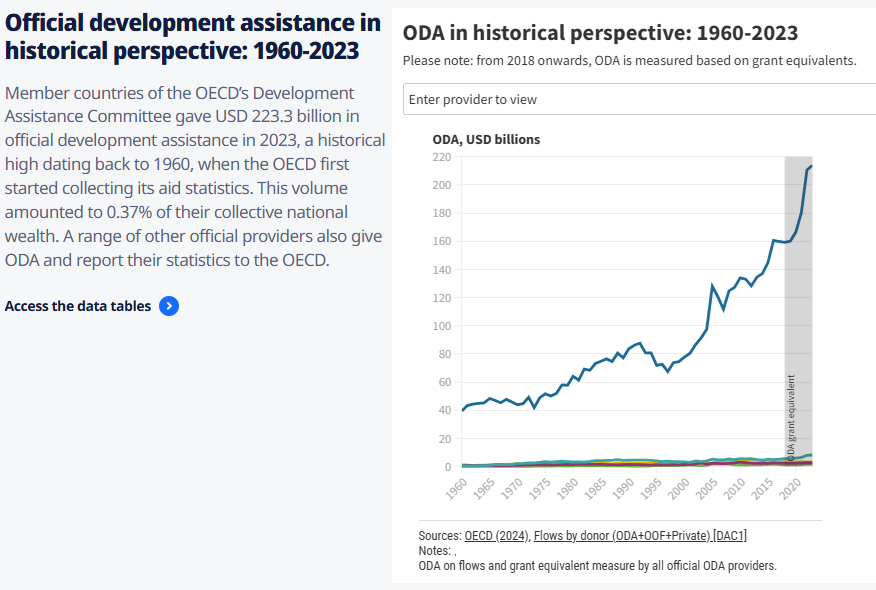  

 

--

Many more development initiatives go unfunded for lack of resources.

---

# Motivation

It is important to know what was achieved as a result of investing in a particular development project. 

--

- What deserves to be scaled up? 

--

- What should be abandoned?

--

- How can current designs be improved?

--

Impact evaluation is to establish a **causal relationship** between an intervention and resulting outcome.

--

- To quantify the magnitude of the changes in the outcomes that can be attributed to the intervention.
  
---

# Objectives of impact evaluation

**Accountability**: to assess ex-post the value of a program to justify its costs.

--

- ensure that benefits due to spurious correlates (e.g., high yields due to good weather, contributions by other interventions at the same time and place) are not assigned to the program.

--

- enable donors to know what obtained can be attributed to the money spent.

--

**Results-based management**: to use the results to make adjustments to the program.

--

- adjustments range from minor to major changes, redesign, and eventual cancellation.

--

- enable stakeholders and implementing agency to learn from both successes and failures.

--

**Generic lessons for the profession**:

--

- impact evaluation results can serve as an international **public good**.

  - non-rival (one person's use does not reduce its availability)
  
  - non-excludable (impossible to prevent others from using once it is provided)

- **external validity** is important.

---

class: inverse, middle, center

# 

  Is there any challenges with impact evaluation?

 

---

class: inverse 

Last week, we've learned how difficult it is to establish a causal relationship between mother education and child health.

--

Because of omitted variables that are correlated with both mother education and child health (e.g., father education, family wealth, healthcare access, etc.)

--

But this is not the only reason.

---

# Do you remember this figure?

    

 

--

We observe a **positive correlation between income and level of literacy** within and across countries.

--

There are **4 possible explanations** for this correlation.

---

# Challenges of impact evaluation

Say that we observe a correlation between $X$ (Education) and $Y$ (Income). There are 4 possible explanations:

--

- **Causality**: $X \rightarrow Y$ 

  - Education causes higher income: more years of schooling $(X)$ directly lead to higher earnings $(Y)$ because people acquire more skills and qualifications.

--

- **Reverse causality**: $Y \rightarrow X$ 

  - Higher income allows for more education: families with higher incomes $(Y)$ may be able to pay for their children to get more education $(X)$.

--

- **Simultaneity**: $X \rightarrow Y$ and $Y \rightarrow X$ 

  - Mutual causation: education improves income, but families with more income can afford better education for their children, resulting in both variables being jointly determined.

--

- **Omitted variable bias**: $Z \rightarrow X$ and $Z \rightarrow Y$ 

  - Ability $(Z)$ affects both: A person's innate ability $(Z)$ can lead to both more education $(X)$ and higher income $(Y)$, causing a spurious correlation between $X$ and $Y$ that is not due to a direct causal link.

---

class: inverse, middle, center

# 

  Then how can we establish true causality?

 

---

# Working example: loan and business profit

Impact is computed as the difference between 

- the outcome some time after the program has started (**factual**)

- the outcome at the same time point **had the program not started** (**counterfactual**)

--

$$\text{Impact} = \text{Factual} - \text{Counterfactual}$$

  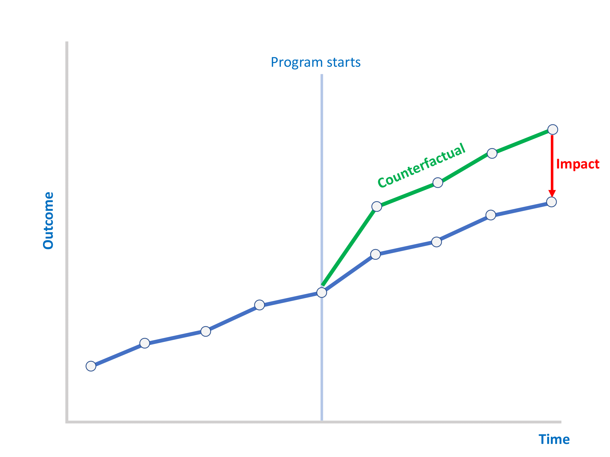
  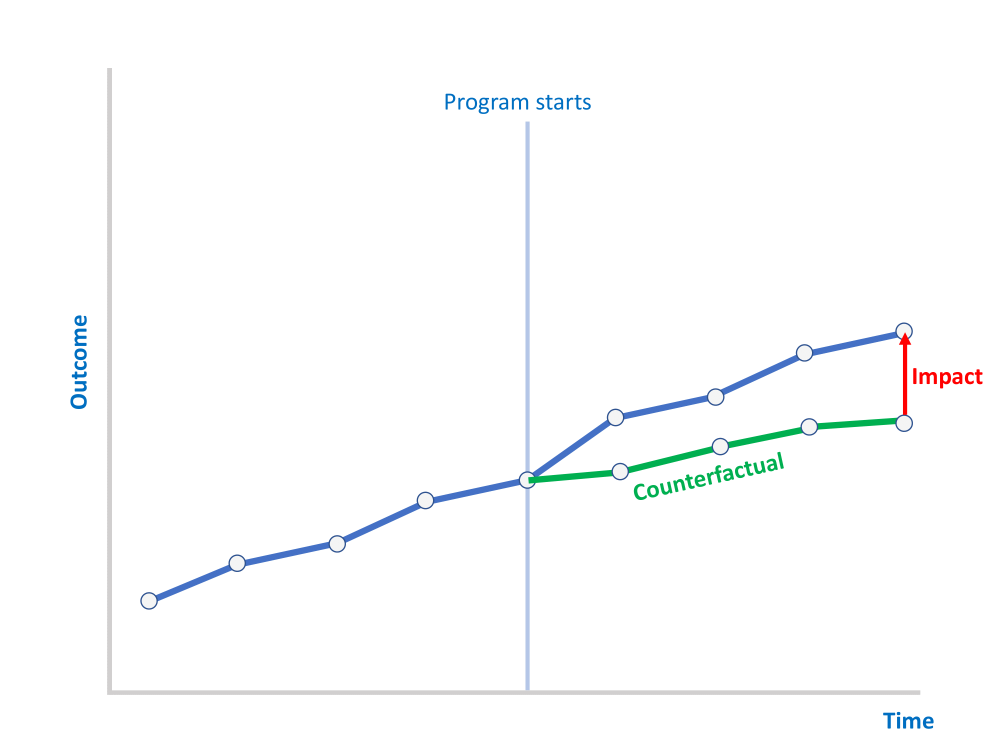

---

Getting the factual is easy.

--

However, the counterfactual cannot be observed.

--

We address this challenge by **constructing the counterfactual**.

--

  - Typically by selecting a group of individuals who did not participate in the program.

--

  - This group is usually referred to as the **control group** or **comparison group**.

--

  - How to select this group is the key decision in impact evaluation design.

---

class: inverse, middle, center

# 

  Impact evaluation methods

 

---

# Common impact evaluation methods

**Randomized Controlled Trial (RCT)**: to construct treatment $T$ and control $C$ ex-ante

--

- regarded as "gold standard" of impact evaluation.

--

- most accurate way of splitting a large population into two statistically identical T & C groups.

--

- impact can be measured by simple differences in observed outcomes between the T & C groups.

--

- not always feasible and ethical.

--

**Difference-in-Differences (DiD)**

--

- the idea is comparing the change in before vs. after outcomes for treated units with the change in before vs. after outcomes for non-treated units.

--

- key identification assumption: the two groups in **parallel trends** (even absent treatment).

---

# Common impact evaluation methods

**Regression Discontinuity (RDD)**

--

- when eligibility for a program is given by a **threshold**, comparing those just above vs. just below.
  
--

- key identification assumption: observations just below and just above the threshold are identical in all aspects other than being treated or not.

--

**Instrumental Variable (IV)**: used to control non-causal correlations.

--

- when participation is endogenous, instrument it with an exogenous factor that influences that program take-up (but otherwise not correlated with the outcome)

--

All methods, except RCT, are called **quasi-experimental** methods.

--

- *quasi-experimental*: to define a comparison group of non-treated that is *as good as* would have been obtained through randomization.

--

In this class, our **focus will be on Randomized Controlled Trials (RCT) and Difference-in-Differences (DiD).**

---

class: inverse, middle, center

# 

  Randomized Controlled Trials (RCT)

 

---

class: inverse

RCTs originated in natural sciences, especially medicine, as a rigorous method to evaluate treatments.

--

When possible, it is regarded as "gold standard" in impact evaluation.

--

Next, I will show you a video about RCT. Let's answer the following questions:

--

- What is the key feature that distinguishes an RCT from other types of impact evaluations?

- Why is random assignment important in establishing causality?

- How does having a control group help us understand the true impact of a program or intervention?

- Can you think of examples of situations where RCTs might be difficult or unethical to conduct?

---

class: inverse

  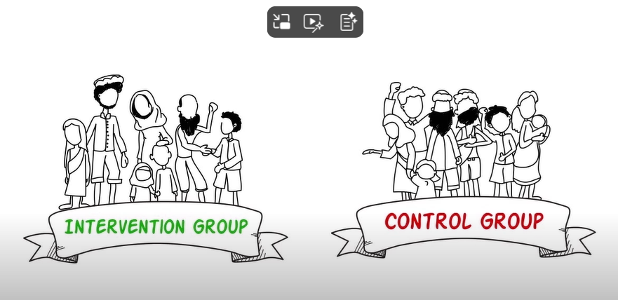  
   <a href="https://youtu.be/Wy7qpJeozec?si=3BSqL3W_rp2qoIq3&t=20">https://youtu.be/Wy7qpJeozec?si=3BSqL3W_rp2qoIq3&t=20</a>

---

# RCT features

- What is the key feature that distinguishes an RCT from other types of impact evaluations?

--

  - random assignment of participants (or units) to treatment and control groups, which ensures the groups are comparable and helps isolate the effect of the intervention from other factors.
  
--

- Why is random assignment important in establishing causality?

--

  - Random assignment removes selection bias by making sure that differences between the treatment and control groups are due only to chance, not systematic differences. 
  
  - This allows us to attribute differences in outcomes directly to the intervention.
  

--

- How does having a control group help us understand the true impact of a program or intervention?

--

  - The control group serves as a counterfactual—representing what would have happened to the treatment group if they had not received the intervention. 
  
  - Comparing outcomes between the treatment and control groups reveals the program’s true causal impact.
  

---

# RCT estimation

With proper randomization, a simple difference between treatment and control groups captures the average treatment effect.

--

- In the simplest version of randomization with 1 treatment and 1 control group, we can estimate RCT using the following regression:

$$Y_{i} = \beta_0 + \beta_1 TREAT_i + \varepsilon_i$$ 
where $TREAT_i = 1$ is unit $i$ is in the treated group, $TREAT_i = 0$ if the control group.

--

- For stratified randomization (e.g., grade level, rural/urban), control for strata dummies $\gamma_i$.
$$Y_{i} = \beta_0 + \beta_1 TREAT_i + \gamma_i + \varepsilon_i$$ 

--

- Control for baseline value of the outcome $Y_0$ when available (ANCOVA analysis).
$$Y_{i} = \beta_0 + \beta_1 TREAT_i + \beta_2 Y_{0i} + \varepsilon_i$$

--

- Use baseline observable covariates $Z_{0i}$ to add precision and to verify as a robustness check.
$$Y_{i} = \beta_0 + \beta_1 TREAT_i + \beta_2 Z_{0i} + \varepsilon_i$$

---

class: inverse, middle, center

# 

  Are RCTs always useful for impact evaluation?

 

---

class: inverse  

   
   <a href="https://youtu.be/Wy7qpJeozec?si=b2eTtjJfnnvV_wsI&t=215">https://youtu.be/Wy7qpJeozec?si=b2eTtjJfnnvV_wsI&t=215</a>

---

# When is RCT feasible?

A common scenario where randomization is practical is when a program aims to serve a **large population**, but **budgetary or administrative constraints** prevent treating everyone at once. 

--

In such cases, a fair and transparent way to decide who receives the intervention first is through a publicly supervised lottery.
  
--

One potential cost to the organization is the need to select a larger pool of candidates (e.g., doubling the sample size).

---

# Ethical considerations with RCTs

When conducting randomized evaluations, researchers must adhere to ethical guidelines to protect human subjects.

--

No harm or deception – Researchers must not intentionally harm participants, mislead them, or leave them worse off than if the experiment had not occurred.

--

Voluntary participation – Participants must have the freedom to opt out or withdraw from the study at any time.

--

Institutional oversight – Studies should be reviewed and monitored by an Institutional Review Board (IRB) to ensure ethical compliance.

---

class: inverse, middle, center

# 

  There are also other threats to causal inference with RCTs.

 

---

# General threats to causal inference

**Bad randomization**: We can verify if randomization was successful with "balance tests"
  
  - The idea is to compare the baseline characteristics between treatment and control groups
  
  - We can improve balance with **stratified randomization**
  
  

  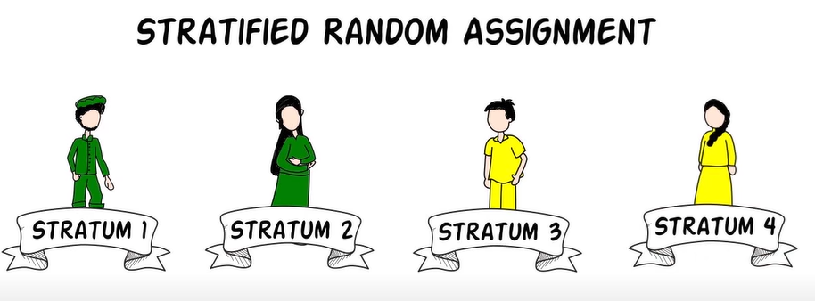 
   <a href="https://youtu.be/Wy7qpJeozec?si=YP7JO1XkkCk_B5Z3&t=304">https://youtu.be/Wy7qpJeozec?si=YP7JO1XkkCk_B5Z3&t=304</a>

  

---

# General threats to causal inference

**Attrition**: People drop out during the study
  
  - It is not a problem as long as attrition is not correlated with the treatment status
  
  - We can compare attrition rates across groups
  
  - If there are difference, there are techniques to bound the estimates, e.g., using "Lee bounds"
  
--

**Spillover effects** (Contamination): the intervention being studied impacts individuals or groups beyond the intended recipients.
  
  - We need to take this into consideration when designing RCTs  

--

**Hawthorne effects**: individuals modify their behavior in response to being observed or receiving attention, rather than due to any specific intervention.       

--

**The anticipation** that an expansion of the program is planned for the control areas in the future as in phased-in design leads individuals to change their behaviors.

---

class: inverse, middle, center

# 

  RCT in Practice: The PROGRESA Program in Mexico

 

---

# PROGRESA 

PROGRESA is a Mexican conditional cash transfer program launched in 1997 that provides cash to poor rural families 

--

- conditional on their children attending school & the family regularly visiting health clinics (**conditional cash transfers**)

--

- aims to break the intergenerational poverty cycle by investing in human capital through education, health, and nutrition.

  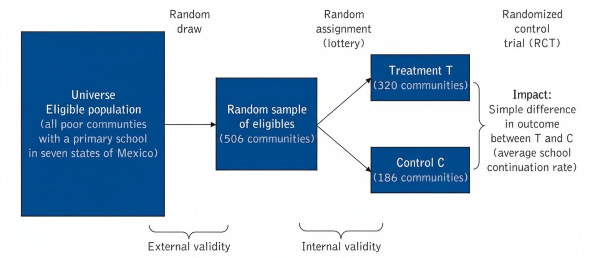

---

# Some concerns about RCTs

**External validity**

--

- RCTs are high on *internal validity*
  
- If RCTs are done properly, the estimated effect is a true causal effect for those in the study
  
--

- But, its external validity is often low

  - Would the same program have the same effect if it were implemented elsewhere?
  
  - Many reasons why the effects of an RCT may not apply in other contexts (institution, sample)
  
--

  - Replication studies are recommended to prove external validity (Kremer and Holla 2008)

---

# Some concerns about RCTs

**Compliance issues**

--
  
- Suppose we now have the resources to conduct an RCT to measure the impact of the loan program.
  
--

- We cannot force people to take the loan, as some (e.g., risk-averse individuals) may simply prefer not to borrow money.

--

- Instead, we offer those in the **treatment group** the **option** to borrow money.

--

  - Some women who received the offer took loans from the program (Group 1).
  
  - Others received the offer but chose not to participate (Group 2).
  
--

- If Group 2 is relatively large, we face a **low take-up problem**.
  
--

- By comparing all individuals offered the chance to borrow (treatment group) to those not offered (control group), we estimate the Intent-to-Treat (ITT) effect—the average impact of being offered the program.
  
--

- However, the ITT does not measure the effect of the program if participation were compulsory.

---

# Some concerns about RCTs

**Equilibrium effects**

- Program effects found in a small study may not generalize what will happen when the program is scaled up nationwide (Heckman et al. 1999)
  
--

- Take training programs for job seekers as an example.
    
--

- At small scale, training might lead to increased employment rates and improved job quality.

--

- However, when we scale up the program to national level, there might be market saturation:

--

  - If many are trained in the same skills, there could be an oversupply in certain job markets.
  
  - This could lead to increased competition & reduced job prospects for some trained individuals.
  

---

class: inverse, middle, center

# 

  Do you have any questions? 

 

---

class: inverse 

In many real-world situations, conducting a Randomized Controlled Trial (RCT) is not feasible or ethical.

--

Governments or organizations often implement policies or programs non-randomly, targeting certain groups or regions but not others.

--

  - minimum wage increases 
  
  - introduction or expansion of health insurance program
  
  - changes in education policy (e.g., compulsory schooling laws, school funding reforms)

--

We still want to rigorously evaluate the impact of such policies despite this non-random assignment.

--

**Difference-in-Differences (DiD)** is a powerful quasi-experimental method that compares changes in outcomes over time between treated and untreated groups.

--

DiD helps control for unobserved factors that are constant over time and isolates the effect of the policy or intervention.

---

class: inverse, middle, center

# 

  Difference-in-Differences

 

---

class: inverse

Suppose we have two groups of regions: one that will have new schools constructed, and another that won’t.

--

In the next slide, you will see how the average school attainment of children in these two groups changes over time.

--

By observing the difference in their school attainment trends, what can we infer about the effect of building new schools?

---

# School construction and attainment 

The following figure plots school attainment before and after the school construction program.

  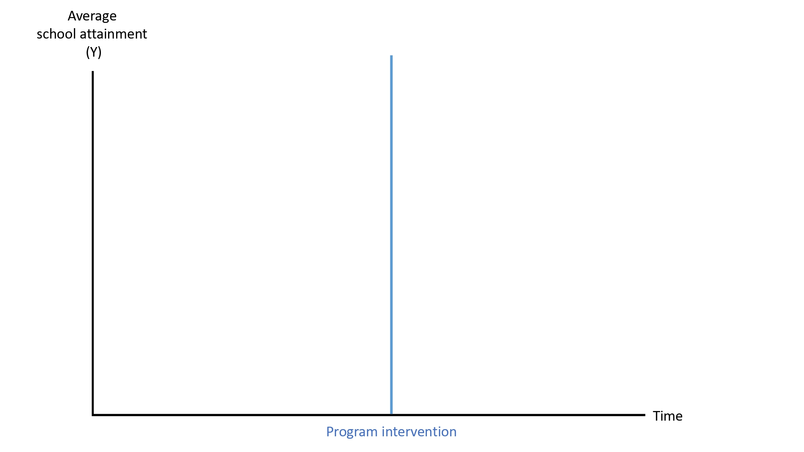

---

# School construction and attainment 

This is how school attainment changes before the program starts among treated regions.

  

---

# School construction and attainment 

This is how school attainment changes after the program starts among treated regions.

  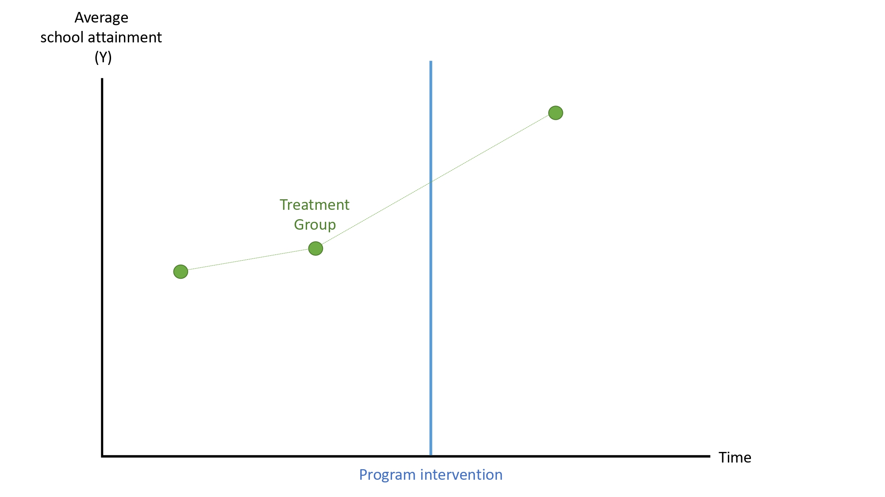

--

What can we say about the impact of this school construction program?

---

# School construction and attainment 

Now we also observe school attainment in other regions that won't receive the program.

  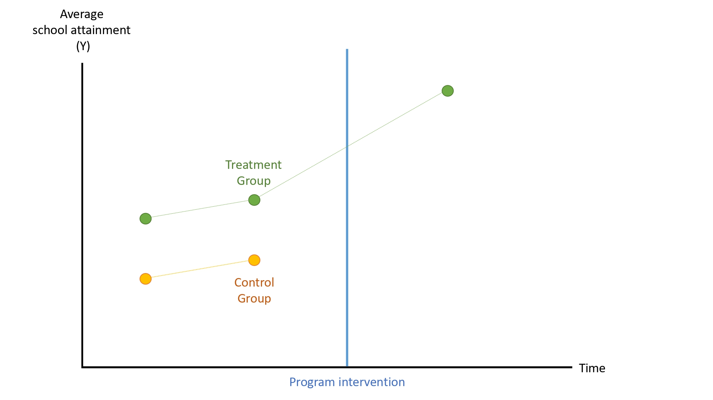

---

# School construction and attainment 

Now we also observe school attainment in other regions that won't receive the program.

  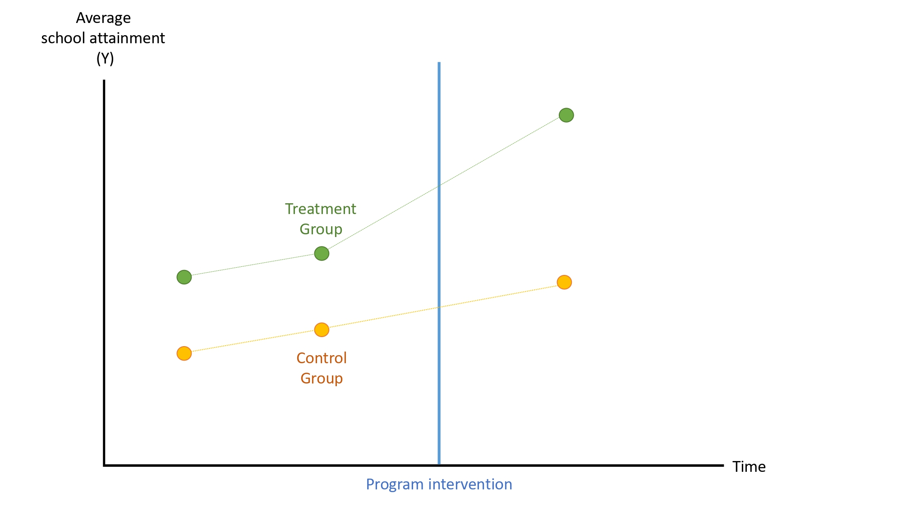

--

What can we say about the impact of this school construction program?

---

# School construction and attainment 

Note that school attainments evolve in similar trends before the program starts.

  

---

# School construction and attainment 

If we assume they would evolve similarly **had the program not started**, then treated regions would be like this.

  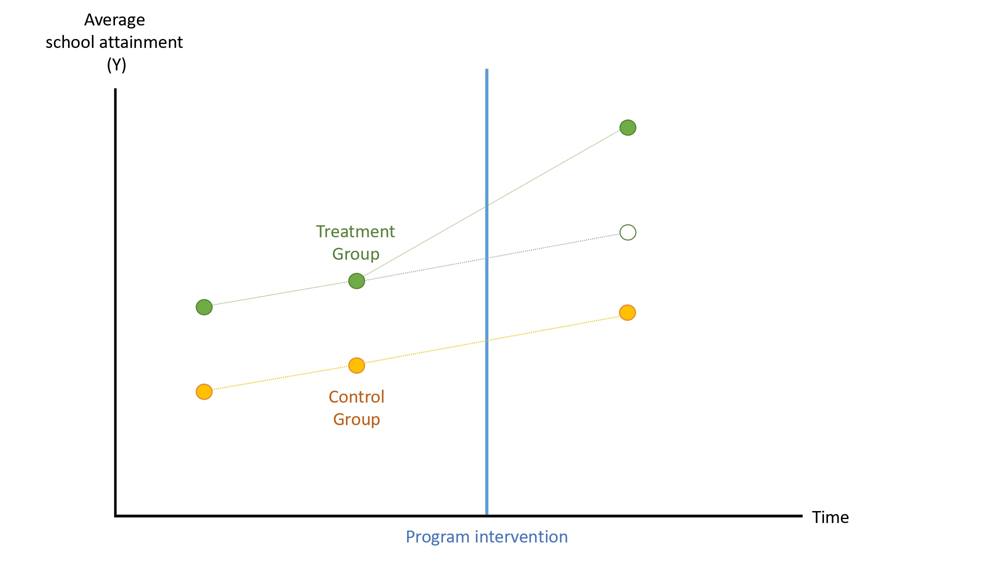

---

# School construction and attainment 

In other words, we construct **the counterfactual** based on the control group.

  

---

# School construction and attainment 

Which allows us to measure the program impact, as the difference between **factual** and **counterfactual**:

  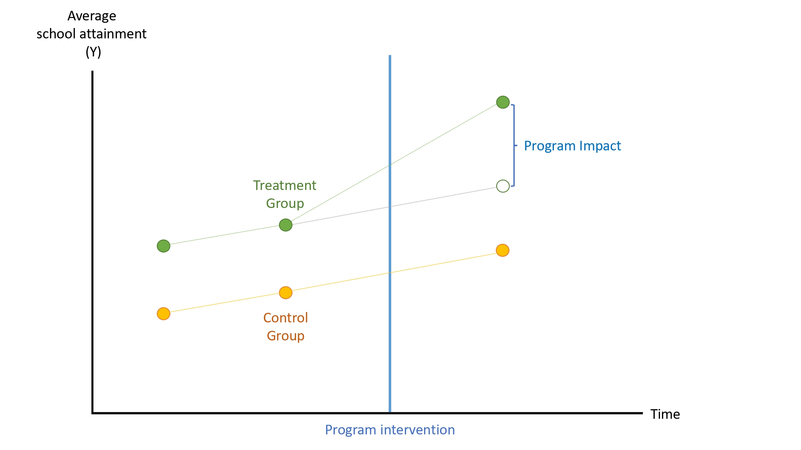

---

class: inverse 

This is the main idea of Difference-in-Differences (DiD).

--

The key assumption for DiD is **parallel trends**.

--

**In the absence of treatment, the treatment and control groups would have followed the same trend over time.**

--

Why is it called "Difference-in-Differences"?

---

# School construction and attainment 

The first difference is the change in the outcome observed in the control group from before to after.

  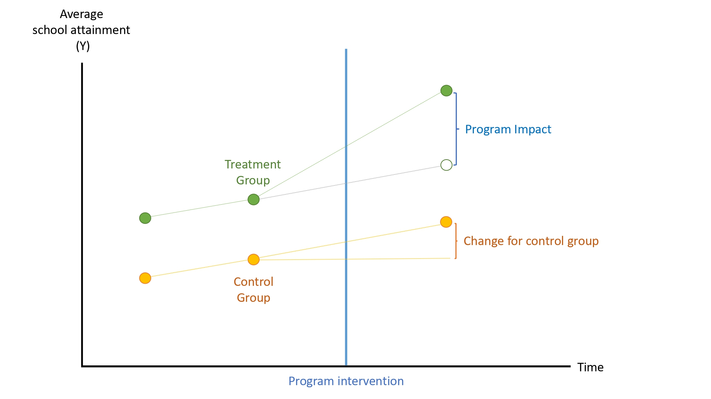

---

# School construction and attainment 

The first difference is the change in the outcome observed in the control group from before to after.

  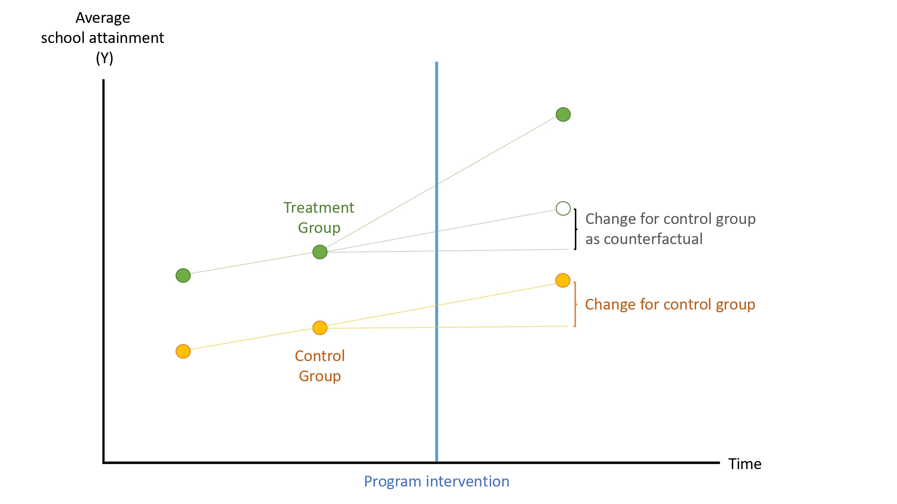

---

# School construction and attainment 

The second difference is the change in the outcome observed in the treatment group from before to after.

  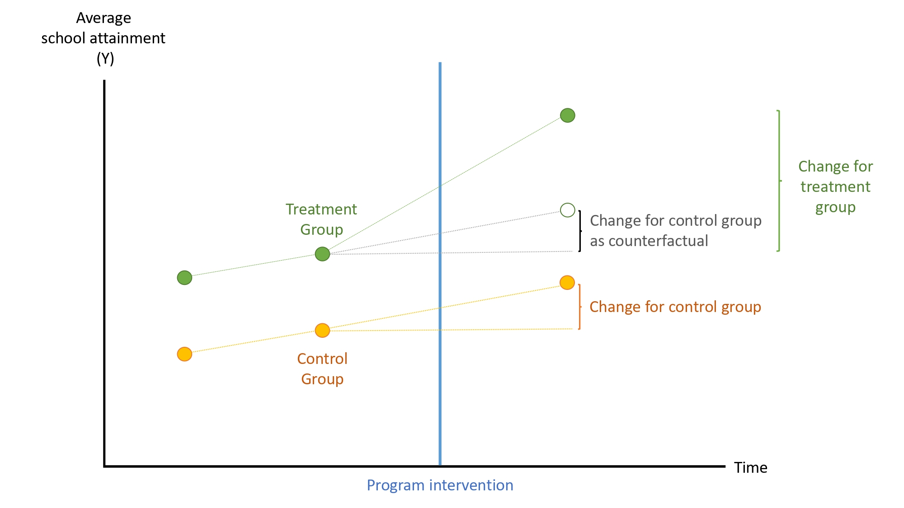

---

# School construction and attainment 

Then, we take the difference between those two changes to isolate the effect of the intervention.

  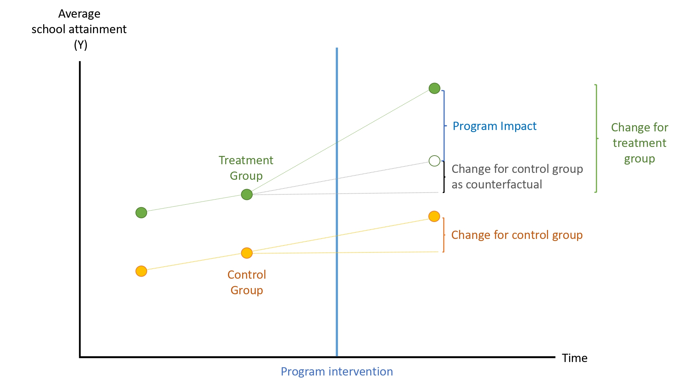

---

# DiD estimation

We can estimate DID using the following regression:

$$Y_{it} = \beta_0 + \beta_1 TREAT_i + \beta_2 POST_t + \beta_3 (POST_t \times TREAT_i) + \epsilon_{it}$$

where 

- $TREAT_i = 1$ if unit $i$ is in the treated group

- $TREAT_i = 0$ if in the control group

- $POST_t  = 1$ if period $t$ is in the post-program period

- $POST_t  = 0$ if period $t$ is in the pre-program period

--

Let us walk through this equation together step-by-step.

---

# DiD estimation

$$Y_{it} = \beta_0 + \beta_1 TREAT_i + \beta_2 POST_t + \beta_3 (POST_t \times TREAT_i) + \epsilon_{it}$$

--

What is the **outcome for control group before and after the program starts**?

--

- Control group $TREAT_i = 0$, before the program starts $POST_t = 0$:

$$Y_{it} = \beta_0 + \beta_1 \times 0 + \beta_2 \times 0  + \beta_3 \times (0 \times 0) = \beta_0$$

--

- Control group $TREAT_i = 0$, after the program starts $POST_t = 1$
$$Y_{it} = \beta_0 + \beta_2$$

--

- So the change in the outcome observed in the control group from before to after is $\beta_2$.

---

# DiD estimation

$$Y_{it} = \beta_0 + \beta_1 TREAT_i + \beta_2 POST_t + \beta_3 (POST_t \times TREAT_i) + \epsilon_{it}$$

--

What is the **outcome for treatment group before and after the program starts**?

--

- Treatment group $TREAT_i = 1$, before the program starts $POST_t = 0$:

$$Y_{it} = \beta_0 + \beta_1 \times 1 + \beta_2 \times 0  + \beta_3 \times (0 \times 1) = \beta_0 + \beta_1$$

--

- Treatment group $TREAT_i = 1$, after the program starts $POST_t = 1$
$$Y_{it} = \beta_0 + \beta_1 + \beta_2 + \beta_3$$

--

- So the change in the outcome observed in the treatment group from before to after is $\beta_2 + \beta_3$.

--

The DiD estimate would be $\beta_3$.

---

class: inverse, middle, center

# 

  DiD in Practice: The school construction program in Indonesia

 

---

# School construction program in Indonesia

During 1974-1978, a large school-construction program took place in Indonesia using resources from the oil boom, with 61,000 new primary schools built.

--

What was the impact of school construction on educational achievements and later on wages earned? 

--

In this setting, we do not have a "pure control group", i.e., all regions have some new schools built.

  - Similarly, data limitation does not allow before and after comparison.

--

Duflo relies on the following ideas:

--

- Not all people were supposed to benefit from having new schools.

--

  - Some cohorts were of school age before the program and **could not benefit** (12–17 years old in 1974) 
  
  - Some cohorts attained school age after the program and **could fully benefit** (2–6 years old in 1974)
  
--

Second, the program intensity differs across regions: some built more schools than others.

---

# DiD: parallel pre-trend

The *pre-trend* is verified by comparing the educational achievements of two cohorts that attended primary school prior to the program: those who were aged 12–17 in 1974 and those 18–24 in 1974.

  

--

$$ATE_{DiD} = (8.49 - 8.02) - (9.76 - 9.4) = 0.11 \quad \text{years of education}$$

---

# Recent advances in DiD

The DiD literature has seen major advances recently, particularly in addressing issues related to treatment heterogeneity, staggered adoption, and improving causal inference techniques. 

--

The conventional DiD with TWFE estimator is generally fine as long as there is single treatment period (e.g., a policy that occurs all at time).

--

But when there are multiple periods and units adopt treatment at different times, we need to use new estimators to address potential biases from heterogeneous treatment effects across units and across time (see Roth et al. 2023 on DiD review).

---

# Main Takeaways

- Impact evaluation is essential for understanding if programs cause desired outcomes, not just correlate with them.

--

- RCTs provide strongest evidence of causality by using randomization to create comparable treatment and control groups.

  - They allow clear attribution of outcome differences to the intervention itself.
  
  - However, RCTs may not always be feasible or ethical in real-world settings.
  
--

- Difference-in-Differences (DiD) is a powerful alternative when randomization is not possible.

  - It compares changes over time between treated and untreated groups, assuming parallel pre-treatment trends.
  
  - DiD helps control for unobserved, time-invariant differences between groups.

--

- Both methods rely on credible counterfactuals—what would have happened in the absence of the program—to isolate causal effects.

--

- Choosing the right evaluation method depends on context, feasibility, ethical considerations, and data availability.

--

- Understanding assumptions behind each method is critical to interpreting results and making sound policy decisions.

---

class: inverse, middle, center

# 

  Do you have any questions? 

 

---

# Plan for next week

- **Monday**: Social-assistance policies
  
  - Reading: [JS] Chapter 14
  

- **Wednesday**: Impacts of social-assistance programs

  - Reading: [JS] Chapter 14

  

---

class: inverse, middle, center

# 

  Thank you!

 

